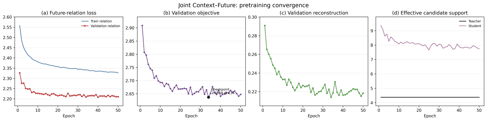
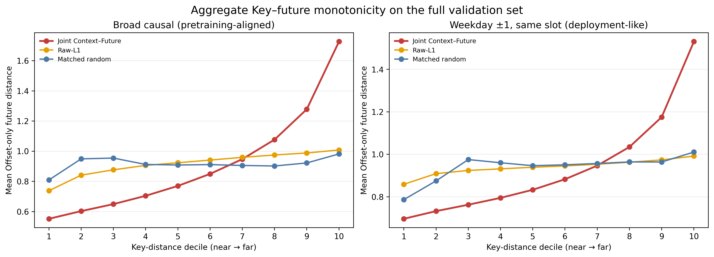
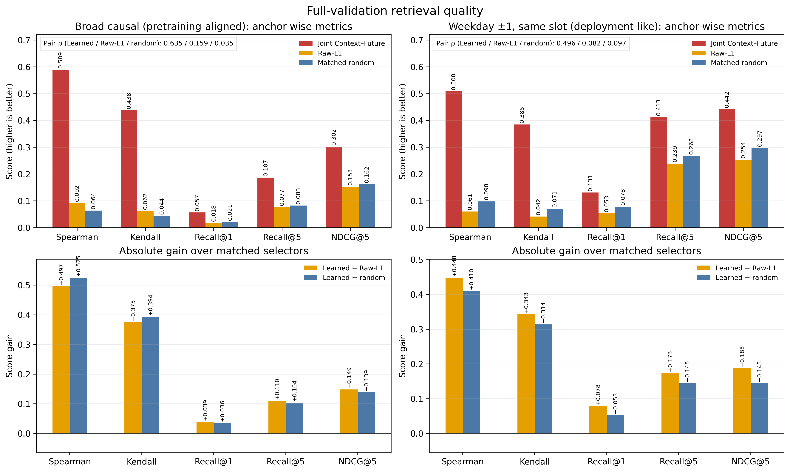
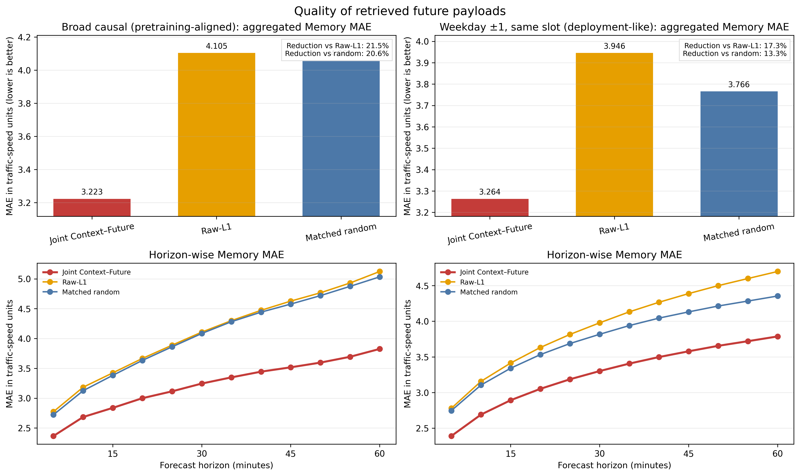
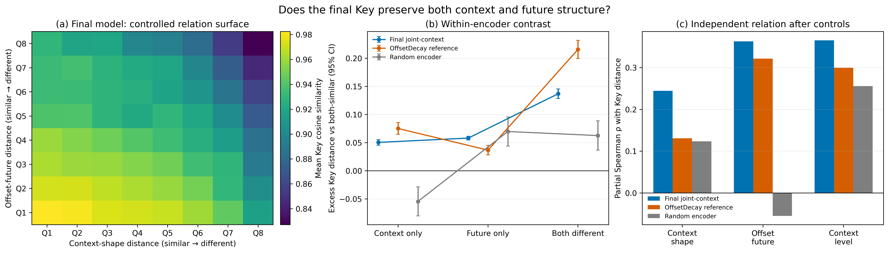
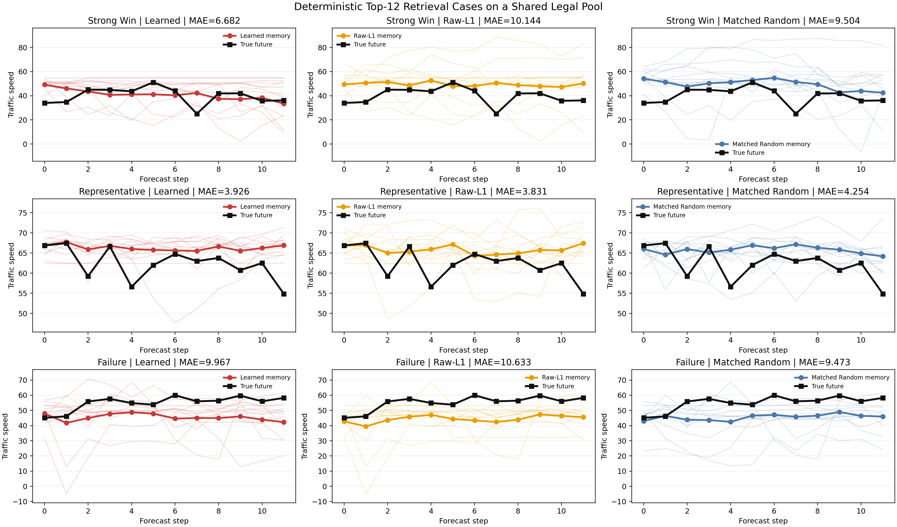
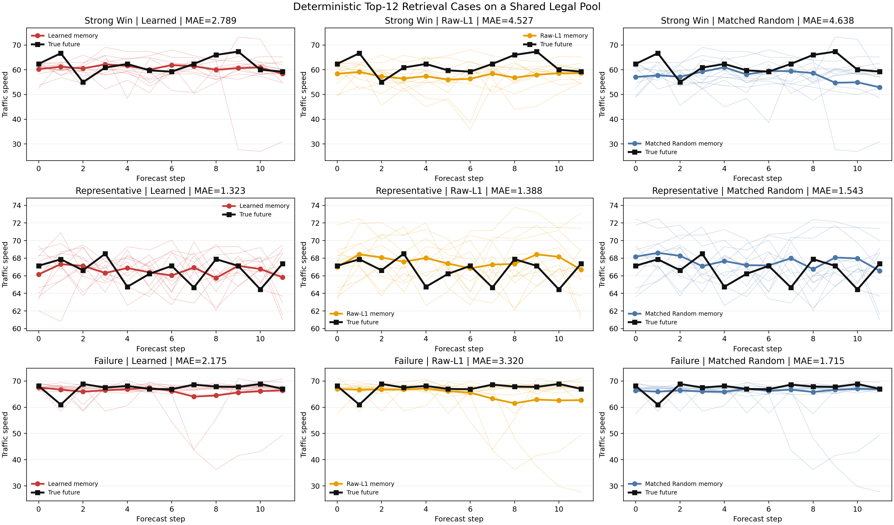
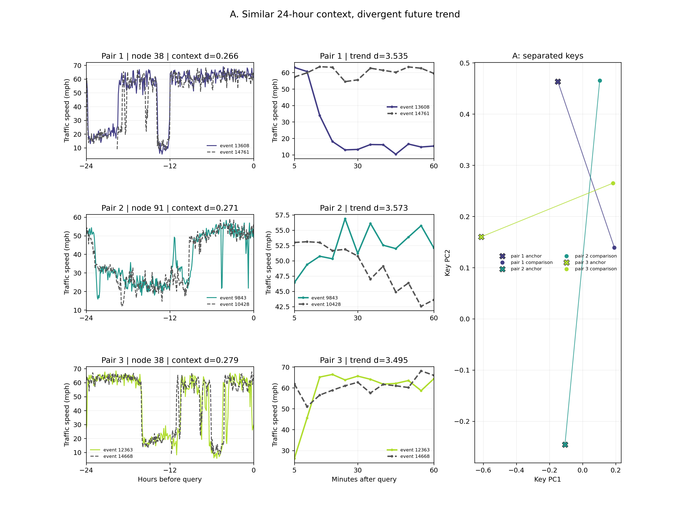
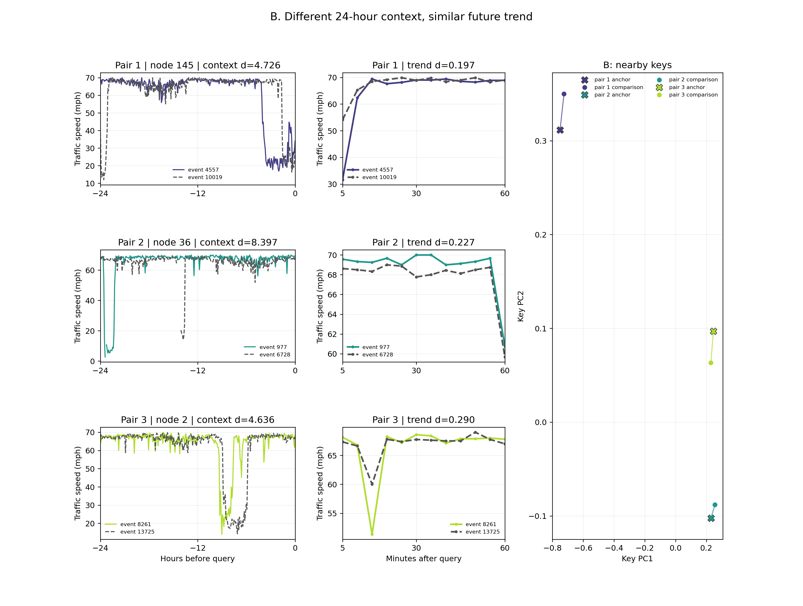

# E5 TGGE Joint Context–Future Offset-only v1（hidden128 + FFN2）：最终 Case Study 实验报告

## 1. 报告范围与结论摘要

本报告评估最终版 `Joint Context–Future + Offset-only` 检索模型是否形成了同时保留交通历史 context 与未来演化关系的可检索 Key 空间，并验证该空间在全量候选排序、统一 Offset-only 载荷重构、context–future–key 关系以及时空海市蜃楼案例中的表现。

最终模型仍采用 `hidden_dim=128`、4 层时空编码器、`FFN multiplier=2`、`retrieval_dim=64`，总参数量为 `958,704`。新版没有增加高成本的动态 context adapter，而是在原有单次 masked 前向与 RetrievalHead 上复用 clean history，通过联合关系 teacher 将 Offset-only future 距离与 context-shape 距离共同用于检索监督。因此，模型容量与旧 hidden128 主线保持一致，变化集中在检索关系的定义上。

主要结论如下：

1. 预训练完整运行 50 轮，无跳过 batch、NaN 或中途退出。按 validation total 选择的正式 checkpoint 位于 epoch 34，`val_total=2.6368`；validation relation 的独立最优值为 epoch 40 的 `2.2079`。两者非常接近，训练后段已进入稳定平台。
2. 在与预训练候选语义一致的 `pretrain_broad_causal` 协议下，最终 Key 的 Pair / Anchor Spearman 分别达到 `0.6353 / 0.5891`，显著高于 Raw-L1 的 `0.1590 / 0.0924` 和 matched-random 的 `0.0351 / 0.0644`。统一 Offset-only payload 后，Memory MAE 为 `3.2230`，相较 Raw-L1 和 random 分别降低 `21.5%` 和 `20.6%`。
3. 在部署侧 `weekday_radius1_overlap` 协议下，事件候选池平均为 `23.98`（范围 `19--27`）。最终 Key 的 Pair / Anchor Spearman 为 `0.4960 / 0.5085`，Memory MAE 为 `3.2636`；相较 Raw-L1 与 random，MAE 分别降低 `17.3%` 与 `13.3%`。这说明收益不依赖宽候选池，在更接近日历检索的约束下仍然成立。
4. Context–Future–Key 诊断覆盖 2,500 个事件、64 个节点和 74,664 个同节点事件对。最终模型的 context-shape / Key 原始 Spearman 为 `0.3006`，高于 OffsetDecay 参考模型的 `0.2011`；控制 calendar、context level 和另一个关系因素后，context-shape 偏 Spearman 仍为 `0.2446`，参考模型为 `0.1309`。因此最终 Key 没有忽略 context shape。
5. 最终模型同时保留 future 与 level 信息：控制其他因素后的 Offset-only future / Key、context level / Key 偏 Spearman 分别为 `0.3629 / 0.3653`。三项信息处于相近数量级，说明模型从旧版的 context-shape 使用不足转向了较均衡的关系表示；level 依赖仍然存在，但不再构成“只看 level、忽略 context”的证据。
6. Mirage A/B 案例均由固定 P8/P92 分位数规则自动产生，没有人工挑图。A 类表明相似 context 下，最终 Key能够分开 future 明显不同的历史事件；B 类表明 context 外观差异较大时，Key 仍能拉近 future 演化相似的事件。这些案例用于解释机制，全量统计承担总体有效性结论。

综合判断：该检索模型已经满足源域定稿条件。现有证据支持“在不增加模型参数的情况下，提高 context-shape 保留能力，同时维持稳定的 future-relevant 检索质量”。后续应把实验资源转向跨域验证和下游校准，而不是继续堆叠检索模块。

## 2. 数据、张量与未来信息边界

METR-LA 包含 `N=207` 个速度传感器，采样间隔为 5 分钟。检索编码器使用 288 步（24 小时）历史，预测 future 为 12 步（60 分钟）：

$$
X^{hist}\in\mathbb{R}^{B\times288\times207\times1},\qquad
Y^{future}\in\mathbb{R}^{B\times12\times207\times1}.
$$

288 步历史按 12 步切分为 24 个 patch。时空编码器输出：

$$
H\in\mathbb{R}^{B\times24\times207\times128},
$$

RetrievalHead 对 24 个 patch 学习池化权重，并输出 L2 归一化的节点级 Key：

$$
K=f_\theta(X^{hist},G)\in\mathbb{R}^{B\times207\times64}.
$$

本报告严格区分三类距离：

- **检索评估中的 Key distance**：query 与候选的 64 维节点 Key 之间的 `1-cosine` 距离。
- **检索评估中的 future distance**：`EndpointAlignedOffsetOnlySignature` 的 masked pair distance，并采用 `symmetric_geometric_mean` 归一化；它是离线 teacher 距离。
- **Context–Future–Key 诊断中的 context-shape distance**：对编码器同口径的 per-window normalized history 计算 24 个 patch mean，再计算共同有效 patch 上的 masked RMS。

Mirage A/B 使用独立但固定的可视化定义：context 先以中位数和 IQR 做节点内 robust 标准化，future 先减去首个有效 future 水平并除以自身时间标准差，Key 距离在原始 64 维空间中按维度归一化的欧氏距离计算。案例图中的二维 PCA 只用于显示六个 Key 点，不参与阈值、筛选或定量结论。

训练阶段允许真实 future 在 `no_grad` teacher 分支中定义历史事件之间的关系；验证阶段 query future 仅用于排序完成后的指标计算、固定分位数案例选择和绘图。排序前可使用的输入只有 query history、calendar metadata、causal Bank metadata、历史 Bank keys 和历史 level。结果文件明确记录：

```text
query_future_used_for_ranking = false
deployment_available_inputs_only_before_ranking = true
```

## 3. 最终模型与联合关系目标

### 3.1 模型和训练配置

| 项目 | 设置 |
|---|---:|
| dataset | METR-LA speed |
| train / val / test samples | 22,681 / 2,993 / 6,025 |
| retrieval context / forecast context | 288 / 12 steps |
| horizon / sampling interval | 12 steps / 5 minutes |
| patch size / patch count | 12 / 24 |
| hidden / retrieval dimension | 128 / 64 |
| encoder layers / heads | 4 / 4 |
| FFN multiplier | 2 |
| route | enabled, top-k=6 |
| RetrievalHead bottleneck | 96 |
| dynamics adapter | `none` |
| objective | `masked_relation_single_view` |
| teacher mode | `offset_only` |
| relation normalization | `symmetric_geometric_mean` |
| context relation weight | 0.2 |
| reconstruction / retrieval weight | 2.0 / 1.0 |
| batch size / epochs | 16 / 50 |
| trainable parameters | 958,704 |

参数构成为 embedding `40,576`、encoder `850,372`、route attention `54,980`、RetrievalHead `66,208`、reconstruction head `1,548`。这些模块合计仍为 `958,704`，说明 context 细化来自监督关系重构，而不是新增大分支。

### 3.2 Offset-only future signature

对事件 $i$，令 $L_i$ 为预测窗口前最后一个有效历史值；如果最后一步缺失，则回退到可见 forecast-context 的均值。Offset-only signature 定义为：

$$
S_i^{F}(h)=Y_i(h)-L_i,\qquad h=1,\ldots,H.
$$

两个事件的原始 future 距离为共同有效 horizon 上的 masked MAE：

$$
d_{ij}^{F}=\operatorname{MaskedMAE}\left(S_i^{F},S_j^{F}\right).
$$

该定义消除了候选事件与 query 的起始绝对水平差，但在所有 horizon 上保留完整的相对变化轨迹，不再引入人工 decay。

### 3.3 Joint Context–Future relation teacher

令 $d_{ij}^{C}$ 为 clean normalized 288-step history 的 masked context distance。为避免不同 anchor 的距离尺度支配联合关系，future 和 context 距离分别使用对称几何均值归一化：

$$
\widehat d_{ij}^{m}
=
\frac{d_{ij}^{m}}
{\sqrt{(\bar d_i^{m}+\epsilon)(\bar d_j^{m}+\epsilon)}},
\qquad m\in\{F,C\},
$$

其中 $\bar d_i^{m}$ 是事件 $i$ 到其合法候选的平均距离。最终联合距离为：

$$
d_{ij}^{joint}
=
\sqrt{0.8\left(\widehat d_{ij}^{F}\right)^2
+0.2\left(\widehat d_{ij}^{C}\right)^2}.
$$

Teacher 与 student 分布分别写为：

$$
q_{ij}
\propto
\exp\left(-\frac{d_{ij}^{joint}}{\tau_t}\right),
\qquad
p_{ij}
\propto
\exp\left(\frac{\cos(K_i,K_j)}{\tau_s}\right),
$$

其中 $\tau_t=\tau_s=0.1$。Relation loss 使 student Key 关系逼近 teacher 关系。联合训练总目标为：

$$
\mathcal L
=
\mathcal L_{relation}
+2\mathcal L_{reconstruction}.
$$

重构损失只在被 mask 且原始观测有效的位置计算。整个训练仍为单次 masked encoder forward；clean context 只在无梯度 teacher 分支计算 pair relation，不增加第二次编码器前向。

### 3.4 下游统一 Offset-only payload

三种选择器在 CaseStudy 中共享完全相同的合法候选池、Top-12 和候选 future。候选 $j$ 的 payload 按 query 与候选末端 level 对齐：

$$
\widetilde Y_{j\rightarrow q}(h)
=Y_j(h)+(L_q-L_j),\qquad h=1,\ldots,H.
$$

这里没有随 horizon 衰减的系数。Learned、Raw-L1、matched-random 之间唯一变化的是候选排序，因此同一协议内的 Memory 质量差异可以归因于 selector，而不是 payload 定义。

## 4. 训练收敛与候选支持



图 1 给出完整 50 轮训练：

- train relation 从 `2.5586` 下降到 `2.3269`；validation relation 从 `2.3271` 下降到约 `2.21`。
- validation total 从 `2.9092` 降至 epoch 34 的最低值 `2.6368`，epoch 50 为 `2.6475`。
- validation reconstruction 从 `0.2910` 降至 epoch 34 的 `0.2141`，末轮为 `0.2185`。
- teacher effective support 稳定为 `4.379`；student support 从 `9.369` 逐步收缩，在 epoch 25 达到最低 `7.665`，正式 checkpoint 为 `7.900`，末轮为 `7.748`。

Student support 始终明显大于 1，也高于 teacher support。结合后续数千万 query-candidate 对上的单调排序关系，可以排除“所有样本收缩到同一个 Key”或“student 只保留单一候选”的全局坍缩解释。support 下降表示模型逐渐集中注意力，但仍保留多候选分布。

## 5. 两个完整协议下的总体检索质量

### 5.1 指标口径

本报告中的两个 Spearman 不可混用：

- **Pair Spearman**：结果字段 `alignment.<selector>.spearman`，把所有有效 query-node-candidate pair 汇总后计算一次全局秩相关。
- **Anchor Spearman**：结果字段 `ranking.<selector>.spearman_mean`，先在每个 `(query,node)` 的完整有效候选池内计算 selector distance 与 teacher distance 的 Spearman，再对有效 anchor 做宏平均。候选少于 2 个或距离非有限的 anchor 被排除。

Anchor Kendall 使用相同的逐 anchor 口径。Recall@K 衡量 teacher future 最近邻与 selector Top-K 的重合比例；NDCG@5 同时考虑候选是否命中以及命中位置。两个协议均包含 2,993 个 query、207 个节点和 `604,643` 个有效排序 anchor。

### 5.2 总体结果

| 协议与指标 | Joint Context–Future | Raw-L1 | Matched random |
|---|---:|---:|---:|
| Broad Pair Spearman | **0.6353** | 0.1590 | 0.0351 |
| Broad Anchor Spearman | **0.5891** | 0.0924 | 0.0644 |
| Broad Anchor Kendall | **0.4377** | 0.0625 | 0.0442 |
| Broad Recall@1 | **0.0569** | 0.0177 | 0.0213 |
| Broad Recall@5 | **0.1869** | 0.0768 | 0.0827 |
| Broad NDCG@5 | **0.3017** | 0.1529 | 0.1625 |
| Weekday±1 Pair Spearman | **0.4960** | 0.0815 | 0.0971 |
| Weekday±1 Anchor Spearman | **0.5085** | 0.0606 | 0.0985 |
| Weekday±1 Anchor Kendall | **0.3849** | 0.0422 | 0.0709 |
| Weekday±1 Recall@1 | **0.1312** | 0.0534 | 0.0784 |
| Weekday±1 Recall@5 | **0.4127** | 0.2393 | 0.2680 |
| Weekday±1 NDCG@5 | **0.4416** | 0.2539 | 0.2971 |



图 2 将每个选择器的 Key distance 分为十个等频区间。Broad-causal 中，最终模型从最近 Q1 的 future distance `0.552` 单调上升到最远 Q10 的 `1.727`；weekday±1 中也从约 `0.70` 上升到约 `1.53`。Raw-L1 与 random 的曲线整体更平坦，说明它们只能弱地区分后续演化。

该图比单个 Top-K 案例更直接：它覆盖完整验证集，而不是只证明少数检索结果“看起来合理”。最终模型两条红色曲线均保持清晰的近低远高关系，表明 Key distance 具备稳定的 future 排序语义。



图 3 上半部分给出三种选择器的原始指标，并在图内单独标注 Pair Spearman；下半部分分别显示 learned 相对 Raw-L1 和 random 的绝对增益。这样既能观察绝对分数，也不会因为只画差值而隐藏基线水平。

### 5.3 Broad-causal 主协议

`pretrain_broad_causal` 要求候选 future 严格早于 query context start，不限制 weekday 或 slot；每个 query 固定保留 96 个合法历史事件。完整验证集包含 `56,694,024` 个有效 node-level pairs。96 是事件级候选池规模；考虑节点缺失后，每个有效 anchor 的平均候选数为 `93.76`。

该协议与预训练 batch 内“非重叠、非自身”的关系监督最一致，因此作为机制分析主结果。最终模型的 Pair Spearman 为 `0.6353`，Anchor Spearman 为 `0.5891`。Pair 值更高并不代表计算方式变化，而是全局 pair 加权与逐 anchor 宏平均对候选规模、节点难度的权重不同。

### 5.4 Weekday±1 部署侧协议

`weekday_radius1_overlap` 要求候选与 query 处在相同日内 slot，循环 weekday 距离不超过 1；候选 future end 不晚于 query context end，因此允许候选的 288-step history 与 query history 重叠，但不会进入 query 的预测区间。事件候选池平均 `23.984`，范围 `19--27`，完整验证集包含 `14,205,494` 个有效 node-level pairs。

候选范围收窄后，Raw-L1 和 random 的部分 Recall/NDCG 会因日历先验而自然提高，但最终模型仍在所有指标上领先。尤其 Anchor Spearman 从 broad 的 `0.5891` 变为 `0.5085`，而不是退化到接近随机，说明 Key 在部署式候选池中仍能提供有效的二次排序。

## 6. 统一 Offset-only 载荷下的 Memory 质量

| 协议与指标 | Joint Context–Future | Raw-L1 | Matched random |
|---|---:|---:|---:|
| Broad Memory MAE | **3.2230** | 4.1046 | 4.0607 |
| Broad Memory RMSE | **6.2335** | 7.4461 | 7.4304 |
| Broad Memory MAPE | **8.8641** | 10.4034 | 11.2702 |
| Weekday±1 Memory MAE | **3.2636** | 3.9462 | 3.7663 |
| Weekday±1 Memory RMSE | **6.1678** | 7.0715 | 6.7613 |
| Weekday±1 Memory MAPE | **8.6135** | 9.8235 | 9.6501 |



Broad-causal 中，最终模型相对 Raw-L1 / random 的 MAE 降幅为 `21.5% / 20.6%`；weekday±1 中为 `17.3% / 13.3%`。逐 horizon 结果如下：

| 协议 | Horizon | Joint Context–Future | Raw-L1 | Matched random |
|---|---:|---:|---:|---:|
| Broad | 15 min | **2.8390** | 3.4256 | 3.3840 |
| Broad | 30 min | **3.2466** | 4.1087 | 4.0858 |
| Broad | 60 min | **3.8272** | 5.1252 | 5.0354 |
| Weekday±1 | 15 min | **2.8944** | 3.4156 | 3.3429 |
| Weekday±1 | 30 min | **3.3029** | 3.9792 | 3.8186 |
| Weekday±1 | 60 min | **3.7884** | 4.6992 | 4.3552 |

最终模型在 12 个 horizon 上均低于两个对照，且优势没有在远端消失。因为候选池、Top-12、future payload 和 Offset-only 对齐方式保持一致，这一组结果可解释为“learned selector 检索到了更有参考价值的历史 future”。它仍是纯 Memory 质量评估，不等同于接入下游 base predictor 后的最终预测误差。

## 7. Context–Future–Key：模型是否真正保留 context

### 7.1 诊断协议

该实验从严格对齐的三个 Bank 中使用相同的 2,500 个事件和 64 个节点：

- 最终 Joint Context–Future Bank，fingerprint `fe9a2189...e5ed42`；
- 旧 OffsetDecay 参考 Bank，fingerprint `7f34ac92...93da74`；
- 同架构 random Bank，fingerprint `006ec4ab...d4b4d7`。

三个 Bank 的事件轴与 future payload 严格匹配。只比较相同 slot 且循环 weekday 距离不超过 1 的同节点事件对，共得到 `4,436` 个 calendar event pairs 和 `74,664` 个有效 node pairs。

### 7.2 原始相关与控制后相关

| Key 距离对应因素 | 最终 Joint Context–Future | OffsetDecay 参考 | Random |
|---|---:|---:|---:|
| Context shape：原始 Spearman | **0.3006** | 0.2011 | 0.2275 |
| Offset-only future：原始 Spearman | **0.5180** | 0.4839 | 0.0905 |
| Context level：原始 Spearman | **0.6008** | 0.5213 | 0.3209 |
| Context shape：偏 Spearman | **0.2446** | 0.1309 | 0.1236 |
| Offset-only future：偏 Spearman | **0.3629** | 0.3214 | -0.0547 |
| Context level：偏 Spearman | **0.3653** | 0.2998 | 0.2560 |

“原始 Spearman”回答 Key 距离与单一因素是否共同变化，但可能混入 level、calendar 和 future 的关联。“偏 Spearman”对其他两项距离与 calendar 差异进行秩残差控制，更适合判断独立贡献。

最终模型的 context-shape 偏相关从参考模型的 `0.1309` 提高到 `0.2446`，增幅约 `86.9%`；同时 future 偏相关从 `0.3214` 提高到 `0.3629`。这说明 context 关系的加入没有以牺牲 future 结构为代价。Level 偏相关仍为最高值之一，但与 future 的 `0.3629` 基本相当，并没有压倒 context 到接近零。



图 5(a) 只画最终模型。横轴 context shape 从相似到不同，纵轴 Offset-only future 从相似到不同，颜色表示平均 Key cosine similarity。左下角最亮、右上角最暗，说明 context 与 future 同时变化时，Key 空间具有一致的二维关系梯度。

图 5(b) 不直接横比三个编码器的绝对 cosine similarity，而是在每个编码器内部，以“context 与 future 都相似”作为自身基线，计算其他三类 pair 的额外 Key distance。这避免最终模型整体 Key 更紧凑时，绝对相似度高被误解释为更优。最终模型对 `Context only / Future only / Both different` 的额外 Key distance 分别约为 `0.0506 / 0.0582 / 0.1369`，两种单因素变化都会被 Key 感知，同时变化时分离最强。

图 5(c) 是跨模型判断的主要证据：最终模型在 context shape、Offset-only future 和 context level 三项偏相关上均高于参考模型和 random。由此可以得出“context 使用得到实质改善”，但不应扩展为“Key 已完整保留全部 288 步信息”。检索表示仍然是任务相关压缩，只需要保留对历史案例选择有用的 context。

## 8. 可审计的 Strong-win、Representative 与 Failure 案例

案例不是人工挑选。对每个有效 `(query,node)` 计算：

$$
g=\operatorname{MAE}_{random}-\operatorname{MAE}_{learned},
$$

然后分别选择最接近 $g$ 的 90%、50% 和 10% 分位数的 anchor；并以“距目标分位数最小、sample id、node id”作确定性 tie break。

| 协议 | 案例 | sample / node | Learned MAE | Raw-L1 MAE | Random MAE | $g$ |
|---|---|---:|---:|---:|---:|---:|
| Broad | Strong win | 26670 / 150 | **6.682** | 10.144 | 9.504 | +2.822 |
| Broad | Representative | 24940 / 80 | 3.926 | **3.831** | 4.254 | +0.328 |
| Broad | Failure | 25878 / 26 | 9.967 | 10.633 | **9.473** | -0.493 |
| Weekday±1 | Strong win | 24563 / 62 | **2.789** | 4.527 | 4.638 | +1.849 |
| Weekday±1 | Representative | 26831 / 136 | **1.323** | 1.388 | 1.543 | +0.220 |
| Weekday±1 | Failure | 26948 / 34 | 2.175 | 3.320 | **1.715** | -0.460 |





Broad representative 中 learned 虽优于 random，但略差于 Raw-L1；两个 failure 中 learned 也确实不如 random。保留这些结果非常重要：检索 Key 学到的是总体上更可靠的排序，而不是对每一个 query 都占优。突发事故、候选池缺少真正相似事件以及同一历史形态对应多种 future，都可能造成局部失败。这正是下游校准器仍需判断“是否使用、使用多少”的原因。

## 9. 时空海市蜃楼 A/B 案例

Mirage 实验使用 5,000 个 Bank 事件和全部 207 个节点。先分别构造 context-neighbor 和 future-neighbor proposals，再用固定分位数定义两类互补事件：

| 阈值 | P8 | P92 |
|---|---:|---:|
| Context distance | 0.3240 | 4.4118 |
| Future-trend distance | 0.3978 | 3.0267 |
| Key distance | 0.0441 | 0.1018 |

Context-neighbor proposals 共 `337,926` 对，future-neighbor proposals 共 `336,777` 对。每类最终展示 3 对，所有 pair 的 future 有效重合率均为 1.0，且没有重复事件。

### 9.1 A 类：Context 相似，但 future 不同

A 类满足：

$$
d_C\le P8,\qquad d_F\ge P92,\qquad d_K\ge P92.
$$

| Pair | Node | Context distance | Future distance | Key distance |
|---|---:|---:|---:|---:|
| A1 | 38 | 0.266 | 3.535 | 0.1116 |
| A2 | 91 | 0.271 | 3.573 | 0.1093 |
| A3 | 38 | 0.279 | 3.495 | 0.1128 |



三对事件的完整 24 小时 context 形态接近，但未来 60 分钟轨迹明显分叉；原始 64 维 Key distance 均超过 P92。它们说明最终 Key 没有简单复制 context 外观，而是能够在历史形态相似时利用与后续演化有关的细节进行分离。

### 9.2 B 类：Context 不同，但 future 相似

B 类满足：

$$
d_C\ge P92,\qquad d_F\le P8,\qquad d_K\le P8.
$$

| Pair | Node | Context distance | Future distance | Key distance |
|---|---:|---:|---:|---:|
| B1 | 145 | 4.726 | 0.197 | 0.0165 |
| B2 | 36 | 8.397 | 0.227 | 0.0166 |
| B3 | 2 | 4.636 | 0.290 | 0.0196 |



这些 pair 的 context 外观明显不同，但 future trend 相近，Key distance 落在最低 P8 内。它们说明最终 Key 允许“表面历史不同、未来演化等价”的事件在检索空间中靠近。A/B 两类合在一起，构成比单向案例更完整的机制解释：Key 同时具备必要的分离性和不变性。

本版按既定计划关闭 population PCA/UMAP clustering。原因不是实验失败，而是主结论已经由全量排序、受控关系统计和固定 Mirage pair 支撑；继续增加总体聚类图会引入额外选择规则并稀释主线。结果文件明确记录 `population_clustering_enabled=false`。

## 10. 证据层级、与旧 OffsetDecay 的比较边界

本报告采用四层证据：

1. **完整验证集总体统计**：两个协议共用 2,993 个 queries，分别覆盖 `56,694,024` 和 `14,205,494` 个有效 pairs。
2. **选择器对照**：Learned、Raw-L1、matched-random 共用事件轴、候选 future、Top-12 与 Offset-only payload，只改变排序距离。
3. **受控关系诊断**：同 calendar、同节点事件对上同时观察 context shape、future 和 level，并报告偏秩相关。
4. **确定性案例**：Strong-win / Representative / Failure 与 Mirage A/B 均按预先固定的分位数规则选择，保留不利案例。

最终模型与旧 HN-OffsetDecay 使用相同的 hidden128 主体与参数规模，但两者的 relation teacher 和 payload 不同。因此：

- Context–Future–Key 实验使用统一的 Offset-only future signature 和严格对齐的事件对，可以直接比较两种 Key 对 context/future/level 的相对敏感性。
- 两版 CaseStudy 的 Pair/Anchor Spearman 对应不同 teacher distance，只适合作为各自协议内相对 Raw-L1/random 的证据，不宜把 `0.6353` 与旧版 `0.6693` 简化为模型退步。
- 两版 Memory MAE 使用 Offset-only 与 OffsetDecay 两种 payload，不能据此单独归因 selector 优劣。最终版源域实验的结论是“统一 Offset-only payload 下，最终 learned selector 显著优于两个匹配对照”。

## 11. 最终判断、局限与论文使用建议

### 11.1 是否可以定稿

可以。理由不是某一个指标达到最高，而是关键风险已经形成闭环：

- 没有全局 Key/候选分布坍缩证据；
- future-relevant 排序在两个完整协议中稳定成立；
- context shape 的独立相关明显高于旧参考和 random；
- level、future、context 三项关系达到可解释的平衡；
- 统一 payload 下的直接 Memory 质量显著优于 Raw-L1 和 random；
- 有机制正例，也完整保留代表性与失败案例。

继续修改检索编码器可能带来边际收益，但会重新打开 Bank 指纹、跨域适配和全部下游验证链。以当前贡献目标和实验进度衡量，继续重构的科研收益低于其验证成本。

### 11.2 论文中建议保留的图表

- 主文机制结果：图 2、图 3、图 5。
- 主文 qualitative case：图 8 与图 9，可合并成一个 A/B figure。
- 训练稳定性与 Memory 质量：图 1、图 4，可放实验分析或附录。
- Strong-win / Representative / Failure：图 6、图 7，适合附录或补充材料，正文报告固定选择规则和失败比例边界。

### 11.3 结论边界

当前证据仍有以下限制：

- 这里只是 METR-LA 源域、seed 42 的完整 CaseStudy，不能替代后续跨数据集结果。
- Context–Future–Key 使用 2,500 个事件和 64 个节点的确定性样本，而不是整个 Bank 的所有节点对。
- Mirage 每类只展示 3 对，属于定性机制证据，不能用来估计总体发生率。
- Memory MAE 衡量检索 future 的直接参考质量，不等同于下游基础预测器与校准器的最终性能。
- 模型保留了任务相关 context，但不能据此宣称完整重构或理解了所有 24 小时交通信息。

因此论文中最稳妥的表述是：

> The learned event embedding preserves complementary context-shape and future-evolution relations. It consistently improves future-neighbor ranking and retrieved-memory quality over raw-context and matched-random selectors under both pretraining-aligned and deployment-like candidate protocols.

## 12. 可复现产物

主要产物如下：

- 配置：`configs/metrla_e5_tgge_joint_context_offset_only_v1_transfer_hidden128_ffn2_b16.yaml`
- 预训练日志：`artifacts/metrla_e5_tgge_joint_context_offset_only_v1_transfer_hidden128_ffn2_b16_seed42/pretrain.log`
- 正式 checkpoint：`artifacts/metrla_e5_tgge_joint_context_offset_only_v1_transfer_hidden128_ffn2_b16_seed42/pretrain_best.pt`（epoch 34）
- 独立 relation checkpoint：`artifacts/metrla_e5_tgge_joint_context_offset_only_v1_transfer_hidden128_ffn2_b16_seed42/pretrain_best_relation.pt`（epoch 40）
- Broad-causal：`artifacts/paper_final_joint_context_offset_only_seed42/source_case_study/pretrain_broad_causal/`
- Weekday±1：`artifacts/paper_final_joint_context_offset_only_seed42/source_case_study/weekday_radius1_overlap/`
- Context–Future–Key：`artifacts/paper_final_joint_context_offset_only_seed42/source_case_study/context_future_key/`
- Mirage A/B：`artifacts/paper_final_joint_context_offset_only_seed42/source_case_study/mirage_ab/`
- 论文级 PNG/PDF 与导出 CSV：`artifacts/paper_final_joint_context_offset_only_seed42/source_case_study/report_figures/`

报告图可以通过下列命令从已完成的 JSON/CSV 结果重新生成，不需要重新训练或重建 Bank：

```powershell
python scripts/plot_case_study_report_figures.py `
  --history artifacts/metrla_e5_tgge_joint_context_offset_only_v1_transfer_hidden128_ffn2_b16_seed42/pretrain_metrics.jsonl `
  --broad-metrics artifacts/paper_final_joint_context_offset_only_seed42/source_case_study/pretrain_broad_causal/metrics.json `
  --exact-metrics artifacts/paper_final_joint_context_offset_only_seed42/source_case_study/weekday_radius1_overlap/metrics.json `
  --model-label "Joint Context–Future" `
  --objective masked_relation_single_view `
  --context-surface artifacts/paper_final_joint_context_offset_only_seed42/source_case_study/context_future_key/context_future_key_surface.csv `
  --context-quadrants artifacts/paper_final_joint_context_offset_only_seed42/source_case_study/context_future_key/level_controlled_quadrants.csv `
  --context-partials artifacts/paper_final_joint_context_offset_only_seed42/source_case_study/context_future_key/partial_rank_correlations.csv `
  --output-dir artifacts/paper_final_joint_context_offset_only_seed42/source_case_study/report_figures
```

所有聚合结果均来自完整验证集运行，未使用 `--max-batches`。原始 JSON/CSV、Bank manifest 对齐证据和未来信息边界字段均保留，可从报告中的每个数字回溯到对应实验产物。
