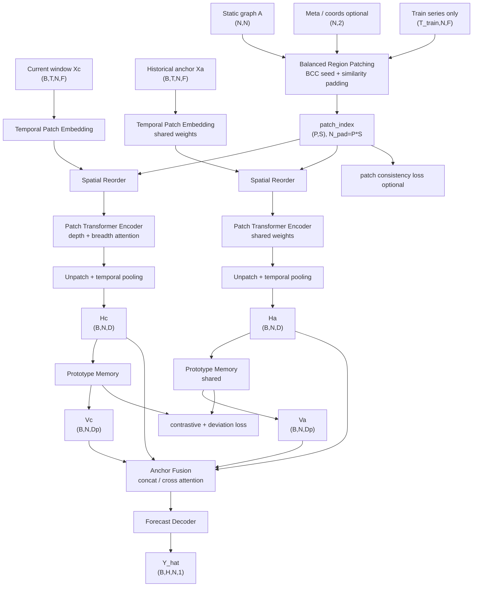

# 第二版思路：PatchAnchor-ST Transformer 实现方案

更新时间：2026-05-27

## 1. 方案定位

第二版不再把 DarkFarseer 只作为 decoder 前的图去噪后处理，而是把它提前到空间建模入口，作为空间 patch 构造的结构先验。整体目标是构建一条新的主干路线：

```text
Balanced spatial patching
  + PatchSTG-style spatial Transformer
  + ST-SSDL historical anchor contrastive learning
```

推荐命名：

```text
PatchAnchor-ST Transformer
```

这条路线的核心定位不是单纯在 METR-LA 上刷一个小幅指标，而是面向：

1. 不规则交通网络中的空间区域不均匀问题。
2. 中大规模交通图中的节点级注意力复杂度问题。
3. 当前交通状态与历史规律偏离导致的时间非平稳问题。

因此第二版更适合主打：

```text
更强泛化性 + 更高可扩展性 + 更鲁棒的时空预测
```

## 2. 为什么需要第二版

当前第一版模型是：

```text
ST-SSDL AGCRN backbone
  + BCC region prototype
  + dynamic graph denoising
```

代码中 AGCRN encoder 已经通过图卷积提取空间特征，DarkFarseer 的 BCC 信息主要在后面通过 `region_prototypes` 修正动态图：

```text
h_cur -> region_prototypes -> GraphDenoisingLayer -> A_clean -> decoder
```

这个设计有两个问题。

第一，BCC 空间信息融入较晚。它没有直接参与 encoder 的空间 token 组织，也没有直接决定 Transformer 或 decoder 看到的空间上下文。

第二，METR-LA 上 BCC 区域大小不均匀。当前统计显示，207 个节点中，positive region 的大小范围为：

```text
min = 1
median = 4
mean = 8.83
max = 33
```

其中 `<=2` 个节点的小区域有 48 个，`>=30` 个节点的大区域有 32 个。小区域容易信息不足，大区域容易过平滑。因此直接把 BCC 区域平均成 region prototype，可能会引入结构噪声。

第二版的思想是：保留 DarkFarseer 的结构区域思想，但不直接信任原始 BCC 区域，而是借鉴 PatchSTG 的 spatial data management，将 BCC 作为初始 seed，再通过相似性补齐和均衡化构造更稳定的 spatial patches。

## 3. 总体框架图



## 4. 输入输出与张量维度

默认交通预测设置：

```text
B: batch size
T: input length，例如 12
H: prediction horizon，例如 12
N: node number
F: traffic feature dim，METR-LA 通常为 1
Ct: time feature dim，建议 tod + dow，最少 tod
D: hidden dimension，例如 64 或 128
Dp: prototype dimension，建议和 D 相同
P: spatial patch number
S: spatial patch size
N_pad = P * S
Tp = T / tem_patch_size
```

### 4.1 原始输入

```text
Xc:    (B,T,N,F)      当前输入窗口
Xa:    (B,T,N,F)      历史锚点窗口
TEc:   (B,T,N,Ct)     当前时间特征
TEy:   (B,H,N,Ct)     预测时间特征
A:     (N,N)          静态路网邻接矩阵
meta:  (N,2) optional 节点经纬度或二维坐标
```

当前 `TrafficRobustST` 中已有：

```text
x:     (B,T,N,1)
x_cov: (B,T,N,1)      tod
x_his: (B,T,N,1)
y_cov: (B,H,N,1)      tod
y:     (B,H,N,1)
```

第二版最小实现可以先只使用 `tod`，后续再扩展 `dow`。

### 4.2 Balanced Region Patching

输入：

```text
A:            (N,N)
train_series: (T_train,N,F)
meta:         (N,2) optional
```

输出：

```text
ori_parts_idx: (N,)       原始节点索引
reo_parts_idx: (N,)       去除 padding 后回填索引
reo_all_idx:   (N_pad,)   patch 重排后索引，包含相似性 padding 节点
patch_index:   (P,S)
patch_mask:    (P,S)
```

核心目标：

```text
原始 BCC 不均匀区域 -> 均衡 spatial patch
```

### 4.3 Temporal Patch Embedding

参考 PatchSTG 的 `input_st_fc`。

输入：

```text
X:  (B,T,N,F)
TE: (B,T,N,Ct)
```

先拼接：

```text
X_in = concat(value, tod, dow optional)
X_in: (B,T,N,F+Ct)
```

使用时间维卷积或线性 patch embedding：

```text
Conv2d kernel=(1,tem_patch_size), stride=(1,tem_patch_size)
```

输出：

```text
Z: (B,Tp,N,D_input)
```

再拼接时间嵌入和节点嵌入：

```text
Z = concat(value_embedding, time_embedding, node_embedding)
Z: (B,Tp,N,D)
```

### 4.4 Spatial Reorder

输入：

```text
Z:           (B,Tp,N,D)
reo_all_idx: (N_pad,)
```

输出：

```text
Z_pad = Z[:,:,reo_all_idx,:]
Z_pad: (B,Tp,N_pad,D)
Z_patch: (B,Tp,P,S,D)
```

其中 padding 节点是根据图相似度、时间相关性或地理邻近度补齐的相似节点。回到原节点顺序时，只使用真实节点对应的 `ori_parts_idx` 和 `reo_parts_idx`。

### 4.5 Patch Transformer Encoder

参考 PatchSTG 的 `WindowAttBlock`，但封装到本项目中，避免直接耦合原仓库训练脚本。

输入：

```text
Z_patch: (B,Tp,P,S,D)
```

patch 内 depth attention：

```text
reshape: (B*Tp*P,S,D)
DepthAttn: attention over S nodes
output: (B*Tp*P,S,D)
```

patch 间 breadth attention：

```text
transpose + reshape: (B*Tp*S,P,D)
BreadthAttn: attention over P patches
output: (B*Tp*S,P,D)
```

输出：

```text
Z_out: (B,Tp,P,S,D)
```

unpatch 后：

```text
Z_node: (B,Tp,N,D)
```

时间聚合：

```text
H = Pool_t(Z_node)
H: (B,N,D)
```

当前窗口与历史锚点共享同一个 encoder：

```text
Hc: (B,N,D)
Ha: (B,N,D)
```

### 4.6 ST-SSDL Historical Anchor Prototype

复用当前 `src/models/prototype.py` 中的 `PrototypeMemory`。

输入：

```text
Hc: (B,N,D)
Ha: (B,N,D)
P_proto: (M,Dp)
```

如果 `D != Dp`，先做投影：

```text
q = Wq H
q: (B,N,Dp)
```

原型注意力：

```text
alpha = softmax(q P_proto^T)
V = alpha P_proto
```

输出：

```text
Vc: (B,N,Dp)
Va: (B,N,Dp)
pos / neg prototype: (B,N,Dp)
```

损失：

```text
L_contrastive = Triplet(q, pos, neg)
L_deviation = |dist(qc,qa) - dist(pc,pa)|
```

这部分负责建模时间非平稳性：如果当前状态和历史锚点状态偏离明显，模型可以通过 prototype deviation 捕捉这种变化。

### 4.7 Anchor Fusion

第二版要避免第一版 decoder 只直接使用 `Hc` 和 `Vc` 的问题。推荐默认直接融合四个张量：

```text
F_anchor = concat(Hc, Ha, Vc, Va)
```

如果 `D = Dp = 64`：

```text
Hc:       (B,N,64)
Ha:       (B,N,64)
Vc:       (B,N,64)
Va:       (B,N,64)
F_anchor: (B,N,256)
```

再经过融合层：

```text
H_fuse = MLP(F_anchor)
H_fuse: (B,N,D)
```

可选增强：

```text
F_anchor = concat(Hc, Ha, Vc, Va, Hc-Ha, Vc-Va)
```

但第一版实现建议先用四张量 concat，减少不必要复杂度。

### 4.8 Forecast Decoder

根据数据规模采用两个 decoder 版本。

#### 小中规模版本：Node-level decoder

适合：

```text
METR-LA, PEMS04, PEMS07, PEMS08
```

输入：

```text
H_fuse: (B,N,D)
TEy:    (B,H,N,Ct)
```

做 horizon 条件预测：

```text
H_step = concat(H_fuse, horizon_time_embedding)
Y_hat = MLP(H_step)
```

输出：

```text
Y_hat: (B,H,N,1)
```

优点是实现简单，便于和当前训练框架对接。

#### 大规模版本：Patch projection decoder

适合：

```text
SD, GBA, GLA, CA
```

输入：

```text
Z_node:  (B,Tp,N,D)
H_fuse:  (B,N,D)
```

将 anchor 信息广播回 temporal patch 表示：

```text
Z_fuse = Z_node + W(H_fuse).unsqueeze(1)
Z_fuse: (B,Tp,N,D)
```

使用 PatchSTG 风格 projection：

```text
Conv2d in_channels = Tp * D
Conv2d out_channels = H
```

输出：

```text
Y_hat: (B,H,N,1)
```

优点是不构造完整 `N x N` 动态图，更适合大规模节点。

## 5. Balanced Region Patching 详细算法

该模块是第二版的核心创新点之一。它把 DarkFarseer 的区域先验和 PatchSTG 的均衡 patch 思想合在一起。

### 5.1 相似度构造

只允许使用训练集统计，避免测试集泄漏。

```text
S_graph = normalize(A + A^T)
S_temp  = corr(train_series_i, train_series_j)
S_geo   = exp(-dist(coord_i, coord_j) / sigma) optional
```

融合：

```text
S = w_graph * S_graph + w_temp * S_temp + w_geo * S_geo
```

默认建议：

```text
有坐标数据: w_graph=0.3, w_temp=0.3, w_geo=0.4
无坐标数据: w_graph=0.5, w_temp=0.5, w_geo=0.0
```

对于大规模数据，`S_temp` 不建议构造完整稠密矩阵，可以只保留 top-k：

```text
S_temp_topk: (N,k)
```

### 5.2 初始区域 seed

根据数据情况选择 seed。

有经纬度：

```text
使用 PatchSTG KDTree 生成初始空间分块
```

无经纬度但有邻接矩阵：

```text
使用 BCC / connected components / graph clustering 生成初始区域
```

有 BCC 但区域不均匀：

```text
大区域 split，小区域 fill
```

### 5.3 大区域拆分

如果某个区域大小 `|R| > S_max`：

```text
递归拆分直到每个区域大小 <= S_max
```

拆分依据优先级：

1. 有坐标：KDTree 二分。
2. 无坐标：基于 `S` 的 spectral bisection。
3. 简化实现：对节点时间序列统计特征做 KMeans。

节点时间统计特征可以包括：

```text
mean, std, peak_time, weekday_mean, weekend_mean optional
```

### 5.4 小区域补齐

如果某个区域大小 `|R| < S`，从区域外选择最相似节点补齐：

```text
candidate = topk_j mean_{i in R} S[i,j]
```

补齐节点可以重复出现在多个 patch 中。它们只用于 attention 上下文，不作为最终输出节点重复计入损失。这一点与 PatchSTG 的 padding 思路一致。

### 5.5 输出索引

保持与 PatchSTG 一致的三个索引：

```text
ori_parts_idx: 原始真实节点顺序
reo_parts_idx: 真实节点在 patch 后张量中的位置
reo_all_idx:   包含补齐节点的 patch 后张量索引
```

## 6. 推荐数据集与场景

### 6.1 METR-LA

用途：

```text
快速原型验证、shape 检查、与当前第一版对齐
```

特点：

```text
N=207，规模不大
有静态邻接矩阵
BCC 区域明显不均匀
```

建议：

```text
不要把 METR-LA 作为第二版最主要卖点
用它证明 balanced patch 比原始 BCC 更稳即可
```

推荐配置：

```text
patch_size S = 8 或 16
tem_patch_size = 3
hidden_dim D = 64
layers = 2
anchor_level = node
decoder = node_mlp
```

### 6.2 PEMS04 / PEMS07 / PEMS08

用途：

```text
验证中等规模交通图上的泛化能力
```

特点：

```text
节点数比 METR-LA 更大
图结构更复杂
不同数据集规模差异明显
```

其中 PEMS07 更适合体现 patch 的价值。

建议：

```text
PEMS04/PEMS08: 作为中等规模验证
PEMS07: 作为第二版重点实验
```

推荐配置：

```text
patch_size S = 16 或 32
tem_patch_size = 3 或 6
hidden_dim D = 64 或 128
layers = 2 到 3
anchor_level = node
decoder = node_mlp
```

### 6.3 SD / GBA / GLA / CA

用途：

```text
验证大规模可扩展性
```

特点：

```text
PatchSTG 原始适配数据
通常带 meta.csv 坐标
节点数从数百到数千甚至更大
```

建议：

```text
这组数据最适合证明第二版的效率和可扩展性
```

推荐配置：

```text
patch_size S = 32 或 64
hidden_dim D = 128
layers = 3 到 4
anchor_level = patch
decoder = patch_projection
```

大规模数据上建议把 historical anchor 从 node-level 改成 patch-level：

```text
H_patch = mean_{i in patch} H_i
H_patch: (B,P,D)
```

这样 prototype memory 的复杂度从 `O(B*N*M)` 降到 `O(B*P*M)`。

## 7. 损失函数设计

总损失：

```text
L = L_pred
  + lambda_c * L_contrastive
  + lambda_d * L_deviation
  + lambda_patch * L_patch
```

### 7.1 预测损失

沿用当前 masked MAE：

```text
L_pred = MaskedMAE(Y_hat, Y)
```

### 7.2 历史锚点原型对比损失

沿用当前 ST-SSDL 风格：

```text
L_contrastive = Triplet(q, pos, neg)
```

### 7.3 偏差学习损失

```text
L_deviation = | ||qc - qa||_1 - ||pc - pa||_1 |
```

其中：

```text
qc, qa: 当前窗口和历史锚点的 query
pc, pa: 当前窗口和历史锚点的正原型
```

### 7.4 Patch consistency loss optional

为了让 balanced patch 不只是索引重排，而是真正形成空间语义区域，可加入 patch consistency loss。

区域原型：

```text
r_p = mean_{i in patch p} H_i
```

节点到 patch 原型的分类：

```text
s_{i,p} = cos(H_i, r_p) / tau
L_patch = CrossEntropy(s_i, patch_id(i))
```

建议第一阶段先不加，等主干跑通后再做消融。

默认权重：

```text
lambda_c = 0.01
lambda_d = 0.01
lambda_patch = 0.01
```

## 8. 编码实现计划

### 8.1 新增文件结构

建议新增：

```text
TrafficRobustST/
  src/
    models/
      spatial_patching.py       # BalancedRegionPatcher
      patch_transformer.py      # WindowAttBlock / PatchEncoder
      patch_anchor_st.py        # PatchAnchorSTTransformer 主模型
      patch_decoder.py          # NodeMLPDecoder / PatchProjectionDecoder
    train_patch_anchor.py       # 第二版训练入口
    patch_preprocessing.py      # 可选，处理 meta / patch cache
  configs/
    metrla_patch_anchor.yaml
    pems07_patch_anchor.yaml
    sd_patch_anchor.yaml
```

### 8.2 `spatial_patching.py`

核心类：

```python
class BalancedRegionPatcher:
    def __init__(
        self,
        patch_size: int,
        max_patch_size: int,
        graph_weight: float,
        temporal_weight: float,
        geo_weight: float,
        use_bcc_seed: bool = True,
    ):
        ...

    def fit(self, train_series, adj_matrix, coords=None):
        ...

    def transform(self):
        return ori_parts_idx, reo_parts_idx, reo_all_idx, patch_index, patch_mask
```

实现顺序：

1. 复用 `src/models/graph_regions.py` 的 BCC 构造能力。
2. 迁移 PatchSTG `kdTree`、`reorderData`、`augmentAlign` 思路。
3. 新增 `split_large_regions` 和 `fill_small_regions`。
4. 将结果缓存到：

```text
data/{dataset}/patch_cache_{S}_{seed}.npz
```

避免每次训练重复计算。

### 8.3 `patch_transformer.py`

核心类：

```python
class WindowAttBlock(nn.Module):
    def forward(self, x):
        # x: (B,Tp,N_pad,D)
        ...

class PatchEncoder(nn.Module):
    def forward(self, z, reo_all_idx, ori_parts_idx, reo_parts_idx):
        # z: (B,Tp,N,D)
        # return z_node: (B,Tp,N,D)
        ...
```

注意：

PatchSTG 原始 `WindowAttBlock` 的输入是：

```text
(B,T,N_pad,D)
```

内部 reshape 为：

```text
(B,T,P,S,D)
```

我们可以保持这个接口，便于复用。

### 8.4 `patch_anchor_st.py`

核心类：

```python
class PatchAnchorSTTransformer(nn.Module):
    def forward(self, x, x_cov, x_his, y_cov, labels=None):
        ...
```

主要流程：

```text
1. embed current window:
   Zc = embedding(x, x_cov)

2. embed historical anchor:
   Za = embedding(x_his, x_cov)

3. shared patch encoder:
   Zc_node = patch_encoder(Zc)
   Za_node = patch_encoder(Za)

4. temporal pooling:
   Hc = pool(Zc_node)
   Ha = pool(Za_node)

5. prototype memory:
   Vc, pos_c, neg_c = prototype(Hc)
   Va, pos_a, neg_a = prototype(Ha)

6. anchor fusion:
   H_fuse = MLP(concat(Hc, Ha, Vc, Va))

7. decoder:
   Y_hat = decoder(H_fuse, y_cov)

8. return prediction and auxiliary losses
```

### 8.5 `train_patch_anchor.py`

可以参考当前 `src/train.py`，保留：

```text
seed
scaler
masked metrics
15min / 30min / 60min metrics
console epoch logs
checkpoint
early stopping
MultiStepLR
```

新增参数：

```text
--patch-size
--max-patch-size
--tem-patch-size
--patch-layers
--patch-factors
--anchor-level node|patch
--decoder-type node_mlp|patch_projection
--use-bcc-seed
--use-similarity-padding
--lambda-patch
--meta-path
--patch-cache-path
```

## 9. 推荐先实现的最小版本

为了控制风险，第二版第一阶段不要一次性做太复杂。推荐最小可跑版本：

```text
数据集: METR-LA
patch seed: BCC
patch fill: temporal similarity + graph similarity
encoder: 2-layer WindowAttBlock
anchor: node-level ST-SSDL prototype
fusion: concat(Hc,Ha,Vc,Va) + MLP
decoder: node-level MLP
loss: MAE + contrastive + deviation
```

先不加：

```text
patch consistency loss
patch-level anchor
large-scale projection decoder
复杂动态图
```

最小训练命令设计：

```powershell
conda activate research
cd D:\projects\researchProjects\TrafficRobustST
python -m src.train_patch_anchor --processed-dir data\METRLA --epochs 100 --patience 20 --batch-size 64 --device cuda:0 --hidden-dim 64 --prototype-dim 64 --prototype-num 20 --patch-size 16 --tem-patch-size 3 --patch-layers 2 --anchor-level node --decoder-type node_mlp --lr-scheduler multistep --lr-milestones 40,70 --lr-decay-ratio 0.1 --output-dir log --run-name metrla_patch_anchor_v1
```

注意：该命令需要在实现 `train_patch_anchor.py` 后才能运行。

## 10. 消融实验设计

### 10.1 空间 patch 消融

| 实验 | 说明 |
|---|---|
| KDTree patch | 只用坐标分块，接近 PatchSTG |
| BCC seed patch | 只用 BCC 初始区域 |
| BCC + similarity fill | 第二版默认 |
| temporal-only fill | 不用图，只用时间相关性补齐 |
| graph-only fill | 不用时间相关性，只用邻接补齐 |

### 10.2 历史锚点消融

| 实验 | 说明 |
|---|---|
| w/o anchor | 去掉 `x_his` 分支 |
| w/o prototype | 保留 `Hc,Ha`，去掉 `Vc,Va` |
| concat only current | 只用 `Hc,Vc` |
| full anchor fusion | 使用 `Hc,Ha,Vc,Va` |

### 10.3 模型规模消融

| 实验 | 说明 |
|---|---|
| patch_size=8 | 局部性强，patch 数多 |
| patch_size=16 | 默认小中图配置 |
| patch_size=32 | 更高效率，可能损失局部细节 |
| node-level anchor | 精细但复杂度高 |
| patch-level anchor | 更适合大规模数据 |

## 11. 与第一版的关系

第一版：

```text
AGCRN 编码器/解码器
动态图生成
BCC 区域原型后置去噪
```

第二版：

```text
Transformer 编码器
空间 patch 前置组织
BCC 作为 patch seed
ST-SSDL anchor 作为时间非平稳模块
```

两版可以形成论文或实验中的两条路线：

| 路线 | 关键词 | 适合场景 |
|---|---|---|
| 第一版 | lightweight graph denoising | 小中规模图、保留 ST-SSDL 主干 |
| 第二版 | balanced spatial patch transformer | 中大规模图、强调可扩展与泛化 |

## 12. 风险与注意事项

### 12.1 METR-LA 可能不能充分体现优势

METR-LA 只有 207 个节点，Patch Transformer 的效率优势不明显。它适合作为 debug 数据集，但不适合作为第二版唯一主实验。

### 12.2 相似性矩阵可能产生数据泄漏

`S_temp` 必须只用训练集构造，不能用验证集或测试集全量序列。

### 12.3 大规模数据不能构造稠密 `N x N`

SD/GBA/GLA/CA 上，如果节点数达到数千，完整相关性矩阵会非常大。需要：

```text
top-k temporal similarity
chunked correlation
cached sparse indices
```

### 12.4 Transformer 容易过拟合小数据

METR-LA 上建议：

```text
hidden_dim <= 64
layers <= 2
dropout = 0.1
weight_decay > 0
```

### 12.5 Patch padding 节点不能重复参与最终损失

补齐节点只作为上下文 token，最终预测和 loss 只计算原始 `N` 个节点。

## 13. 阶段计划

### Phase 1：METR-LA 最小闭环

目标：

```text
跑通第二版主干，验证 shape、loss、训练稳定性
```

实现：

```text
spatial_patching.py
patch_transformer.py
patch_anchor_st.py
train_patch_anchor.py
```

评价：

```text
与 ST-SSDL 本地复现、第一版 full、第一版 no_darkfarseer 对比
```

### Phase 2：PEMS07 中等规模验证

目标：

```text
验证 balanced patch 在更大交通图上的有效性
```

重点：

```text
patch_size 搜索
anchor fusion 消融
similarity padding 消融
```

### Phase 3：PatchSTG 大规模数据验证

目标：

```text
验证可扩展性和效率
```

数据：

```text
SD / GBA / GLA / CA
```

重点：

```text
patch-level anchor
projection decoder
训练时间、显存、推理时间
```

## 14. 预期贡献表述

第二版可以总结为三个贡献点：

1. 提出 balanced region patching，将 DarkFarseer 的结构区域先验和 PatchSTG 的空间数据管理结合，缓解原始 BCC 区域不均匀问题。
2. 设计 patch-based spatial Transformer，在 patch 内和 patch 间分别建模局部与全局空间依赖，提升中大规模交通图上的可扩展性。
3. 引入 ST-SSDL historical anchor prototype，对当前窗口和历史锚点进行原型对比与偏差学习，增强对时间非平稳交通模式的鲁棒性。

一句话版本：

```text
第二版面向不规则和中大规模交通网络，通过均衡空间 patch 管理解决空间结构不均匀，通过历史锚点原型学习解决时间非平稳，从而形成更泛化、更可扩展的鲁棒交通预测框架。
```
