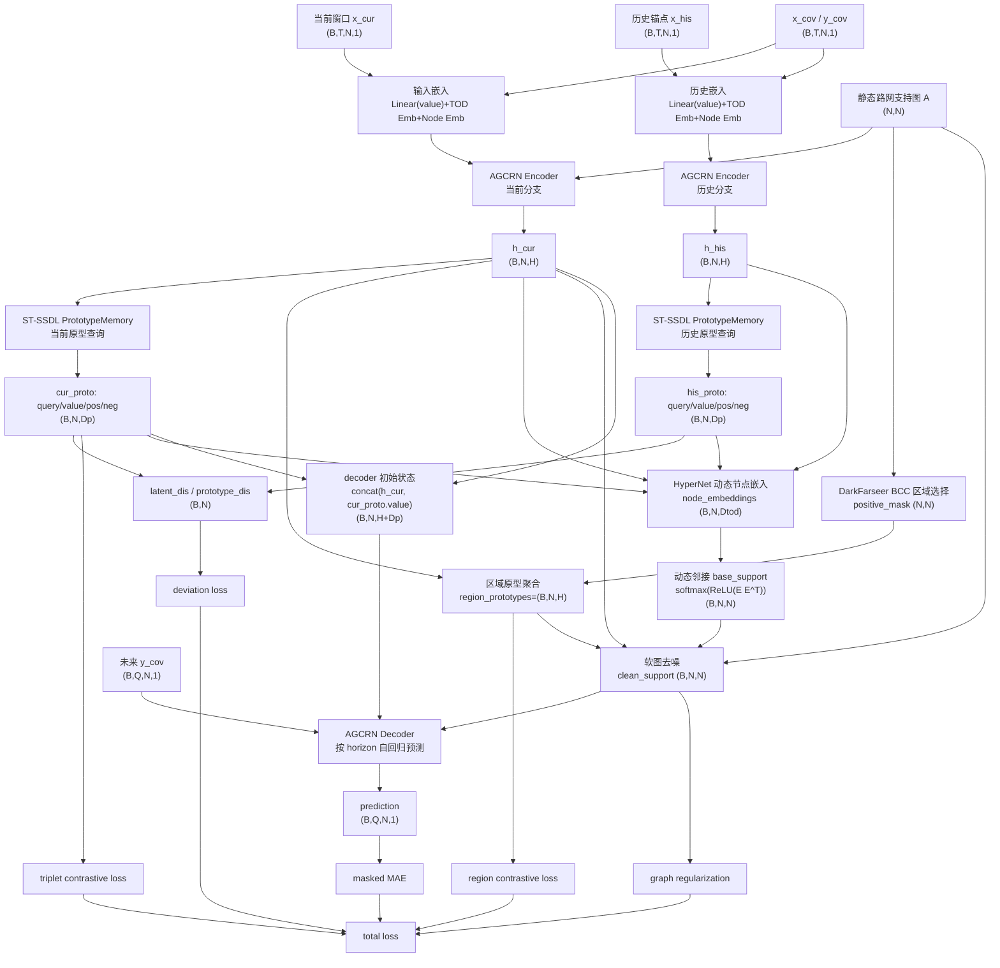

# 首版实现说明

本版按 `鲁棒交通预测修改方案.md` 中推荐的主线实现：

```text
ST-SSDL 历史偏差原型
  + DarkFarseer BCC 区域语义原型
  + 软图去噪
```

## 代码结构

```text
src/
  preprocessing.py          # METR-LA -> trainhis/valhis/testhis.npz
  data.py                   # npz loader, StandardScaler, prepare_x_y
  metrics.py                # masked MAE/RMSE/MAPE, horizon metrics
  losses.py                 # MAE + contrastive + deviation + region + graph reg
  train.py                  # smoke test / train entry
  utils.py                  # adj loading, normalization, seed
  models/
    agcrn.py                # 参考 ST-SSDL 的 AGCN/AGCRN encoder/decoder
    prototype.py            # 参考 ST-SSDL 的 learnable prototypes
    graph_regions.py        # 参考 DarkFarseer 的 BCC 正负区域选择
    graph_denoise.py        # DarkFarseer SDGS 思路的软图去噪
    region_stssdl.py        # 主模型 RegionAwareSTSSDL
```

## 关键接口

输入使用 ST-SSDL 风格：

```text
x: (B, 12, N, 3)
  x[..., 0] = 当前序列值
  x[..., 1] = time-in-day
  x[..., 2] = 训练集历史锚点

y: (B, 12, N, 3)
  y[..., 0] = 预测真值
  y[..., 1] = 未来 time-in-day
```

模型输出：

```text
prediction: (B, 12, N, 1)
clean_support: (B, N, N)
query/pos/neg: (2, B, N, Dp)
latent_dis/prototype_dis: (B, N)
region_loss, graph_reg_loss: scalar
```

## 整体模型图



其中 `T=12` 是输入历史步长，`Q=12` 是预测步长，`N=207` 是 METR-LA 传感器节点数，`H=rnn_units`，当前完整实验中为 64，`Dp=prototype_dim`，当前为 64，`Dtod=tod_embed_dim`，当前为 20。

## 模块说明与核心公式

### 1. 输入嵌入模块

代码位置：`src/models/region_stssdl.py` 的 `_embed_sequence` 和 `_embed_decoder_input`。

作用：把速度值、一天中的时间位置、节点身份编码到同一个特征空间，供图循环网络使用。

输入输出：

```text
values: (B,T,N,1)
tod:    (B,T,N,1)
node_embedding: (N,Dn)
encoder input:  (B,T,N,Dx+Dtod+Dn+Da)
decoder input:  (B,N,Dx+Dtod+Dn)
```

核心公式：

```text
e_x = Linear(x)
e_t = Emb_tod[floor(tod * 288)]
e_n = Emb_node[n]
z_t,n = concat(e_x, e_t, e_n, e_adaptive)
```

当前默认 `Dx=3`，`Dtod=20`，`Dn=25`，`Da=0`，所以 encoder 每个节点每个时间步输入维度是 `48`。

### 2. 双路 AGCRN 编码器

代码位置：`src/models/agcrn.py` 和 `src/models/region_stssdl.py` 的 `_encode_pair`。

作用：分别编码当前窗口 `x_cur` 与同星期同时间槽的历史锚点 `x_his`，得到当前状态和历史状态。这样可以显式建模“当前状态相对历史规律的偏离”。

输入输出：

```text
当前嵌入: (B,T,N,Fenc) -> h_cur: (B,N,H)
历史嵌入: (B,T,N,Fenc) -> h_his: (B,N,H)
```

AGCN 的 Chebyshev 图卷积：

```text
T_0(A)=I
T_1(A)=A
T_k(A)=2 A T_{k-1}(A)-T_{k-2}(A)
AGCN(X,A)=concat(T_0(A)X, ..., T_{K-1}(A)X) W + b
```

AGCRN 单元：

```text
[z_t, r_t] = sigmoid(AGCN(concat(x_t, h_{t-1}), A))
h~_t = tanh(AGCN(concat(x_t, z_t * h_{t-1}), A))
h_t = r_t * h_{t-1} + (1-r_t) * h~_t
```

这里 `A` 是预处理后的静态支持图，当前 `cheb_k=3`。

### 3. ST-SSDL 原型记忆模块

代码位置：`src/models/prototype.py`。

作用：把节点隐藏状态映射到可学习原型空间，找到最相似和次相似原型，用于混杂/历史偏差建模和对比约束。

输入输出：

```text
h_cur / h_his: (B,N,H)
query:         (B,N,Dp)
attention:     (B,N,M)
value:         (B,N,Dp)
pos / neg:     (B,N,Dp)
```

其中 `M=prototype_num`，当前为 20。

核心公式：

```text
q_i = h_i W_q
alpha_i = softmax(q_i P^T)
v_i = alpha_i P
p_i^+ = P[argmax(alpha_i)]
p_i^- = P[second_argmax(alpha_i)]
```

当前分支和历史分支都会经过同一个 `PrototypeMemory`：

```text
latent_dis_i = ||q_i^cur - q_i^his||_1
prototype_dis_i = ||p_i^{cur,+} - p_i^{his,+}||_1
```

### 4. BCC 区域原型模块

代码位置：`src/models/graph_regions.py` 和 `src/models/graph_denoise.py` 的 `RegionPrototypeBuilder`。

作用：参考 DarkFarseer 的 BCC 思路，先在静态路网中为每个节点选出结构相关的正区域，再把这些区域内节点状态聚合成区域原型。它提供比单点节点隐藏状态更稳定的区域语义。

输入输出：

```text
raw_adj:        (N,N)
positive_mask:  (N,N)
h_cur:          (B,N,H)
region_proto:   (B,N,H)
```

核心公式：

```text
M^+_{i,j} = normalized positive region mask from BCC
r_i = sum_j M^+_{i,j} h_j
```

区域对比损失：

```text
s_{i,j} = cos(h_i, r_j) / tau
L_region = CrossEntropy(s_i, label=i)
```

当前 `tau=0.5`。

### 5. 动态图生成与软图去噪

代码位置：`src/models/region_stssdl.py` 的 `hypernet` 和 `src/models/graph_denoise.py` 的 `GraphDenoisingLayer`。

作用：先用当前隐藏状态、当前原型、历史隐藏状态、历史原型生成样本级动态图，再用节点相似度、区域原型相似度和静态路网先验进行软去噪，降低不可靠动态边的影响。

输入输出：

```text
h_cur:            (B,N,H)
h_his:            (B,N,H)
cur_proto.value:  (B,N,Dp)
his_proto.value:  (B,N,Dp)
node_embeddings:  (B,N,Dtod)
base_support:     (B,N,N)
clean_support:    (B,N,N)
edge_reliability: (B,N,N)
```

动态邻接：

```text
E = HyperNet(concat(h_cur, v_cur, h_his, v_his))
A_dyn = softmax(ReLU(E E^T))
```

边可靠度：

```text
S_h = cos(h_i, h_j)
S_r = cos(r_i, r_j)
R = sigmoid((1 - 1/Ksp) * S_h + (1/Ksp) * S_r)
```

图去噪：

```text
A_clean = A_dyn * R
A_clean = (1 - beta) * A_clean + beta * A_static
A_clean = row_normalize(A_clean)
```

当前 `Ksp=3`，`beta=graph_static_weight=0.15`。

图正则：

```text
L_graph = mean(|A_clean - stopgrad(A_dyn)|)
```

### 6. AGCRN 解码器与预测头

代码位置：`src/models/region_stssdl.py` 的 decoder loop。

作用：使用去噪后的动态图 `clean_support` 进行未来 12 步自回归预测。

输入输出：

```text
decoder 初始状态: concat(h_cur, cur_proto.value) -> (B,N,H+Dp)
每一步输入:       concat(prev_y, future_tod, node_emb) -> (B,N,Fdec)
每一步输出:       go -> (B,N,1)
最终 prediction:  (B,Q,N,1)
```

核心流程：

```text
h_0^dec = concat(h_cur, v_cur)
go_0 = 0
for q in 1..Q:
    z_q = embed_decoder_input(go_{q-1}, y_cov_q)
    h_q^dec = AGCRNDecoder(z_q, h_{q-1}^dec, A_clean)
    go_q = Linear(h_q^dec)
```

训练时如果开启 curriculum learning，会按采样阈值把上一时刻预测替换成真实标签：

```text
epsilon_b = cl_decay_steps / (cl_decay_steps + exp(batches_seen / cl_decay_steps))
go_q = y_q with probability epsilon_b
```

### 7. 总损失函数

代码位置：`src/losses.py`。

作用：在预测误差之外，加入原型对比、历史偏差对齐、区域语义对比和图去噪正则。

输入输出：

```text
prediction: (B,Q,N,1)
target:     (B,Q,N,1)
query/pos/neg: (2,B,N,Dp)
latent_dis/prototype_dis: (B,N)
region_loss: scalar
graph_reg_loss: scalar
```

核心公式：

```text
L_pred = masked_MAE(inverse_scale(y_hat), y)
L_tri = TripletMargin(q_cur, p_cur^+, p_cur^-, margin=0.5)
L_dev = ||stopgrad(latent_dis) - prototype_dis||_1
L_total = L_pred
        + lambda_c * L_tri
        + lambda_d * L_dev
        + lambda_region * L_region
        + lambda_graph * L_graph
```

当前默认权重：

```text
lambda_c = 0.01
lambda_d = 1.0
lambda_region = 0.05
lambda_graph = 0.001
```

## research 环境依赖安装

你的目标环境：

```text
conda env: research
Python: 3.10
本机 CUDA Toolkit/驱动环境: 13.2
```

PyTorch 官方当前稳定版安装选择器提供 CUDA 11.8、12.6、12.8 等 wheel，没有直接的 `cu132` wheel。通常不需要本机 CUDA Toolkit 版本与 PyTorch wheel 名称完全一致，只要 NVIDIA 驱动足够新，可以安装 PyTorch 自带 CUDA runtime 的 `cu128` 版本。

推荐 GPU 版安装：

```powershell
conda activate research
python -m pip install --upgrade pip
python -m pip install numpy pandas scipy scikit-learn tables
python -m pip install torch torchvision torchaudio --index-url https://download.pytorch.org/whl/cu128
```

如果 CUDA 环境临时有问题，可先用 CPU 版排障：

```powershell
conda activate research
python -m pip install --upgrade pip
python -m pip install numpy pandas scipy scikit-learn tables
python -m pip install torch torchvision torchaudio
```

安装后检查：

```powershell
conda activate research
python -c "import torch; print(torch.__version__); print(torch.cuda.is_available()); print(torch.version.cuda)"
```

## 验证命令

以下命令默认在 `research` 环境中执行。

最小前向与反传：

```powershell
conda activate research
python -m src.train --smoke-test
```

生成小样本 METR-LA 切分：

```powershell
conda activate research
python src\preprocessing.py --traffic-h5 data\METR-LA.h5 --output-dir data\METRLA_smoke --max-windows 256
```

真实数据小闭环训练：

```powershell
conda activate research
python -m src.train --epochs 1 --batch-size 8 --max-batches 1 --device cpu --rnn-units 16 --prototype-dim 16 --prototype-num 8 --tod-embed-dim 8 --node-embedding-dim 8 --processed-dir data/METRLA_smoke
```

完整 METR-LA 预处理：

```powershell
conda activate research
python src\preprocessing.py --traffic-h5 data\METR-LA.h5 --output-dir data\METRLA
```

完整训练命令：

```powershell
conda activate research
python -m src.train --processed-dir data\METRLA --epochs 100 --patience 20 --batch-size 64 --device cuda:0 --rnn-units 64 --prototype-dim 64 --prototype-num 20 --tod-embed-dim 20 --node-embedding-dim 25 --lr-scheduler multistep --lr-milestones 40,70 --lr-decay-ratio 0.1 --output-dir log --run-name metrla_region_full_v2
```

DarkFarseer 模块消融命令：

```powershell
conda activate research
python -m src.train --processed-dir data\METRLA --epochs 100 --patience 20 --batch-size 64 --device cuda:0 --rnn-units 64 --prototype-dim 64 --prototype-num 20 --tod-embed-dim 20 --node-embedding-dim 25 --lr-scheduler multistep --lr-milestones 40,70 --lr-decay-ratio 0.1 --no-region-loss --no-graph-denoise --lamb-region 0 --lamb-graph 0 --output-dir log --run-name metrla_no_darkfarseer
```

## 已验证结果

`--smoke-test` 已通过：

```text
prediction=(2, 12, 8, 1)
clean_support=(2, 8, 8)
```

真实 METR-LA 小闭环已通过：

```text
trainhis: (179, 12, 207, 3)
valhis:   (26, 12, 207, 3)
testhis:  (51, 12, 207, 3)
```

## 后续建议

1. 用完整 METR-LA 生成 `data/METRLA`。
2. 先跑 `rnn_units=64` 的轻量实验确认收敛，再切到 `rnn_units=128`。
3. 用 `--no-region-loss`、`--no-graph-denoise` 做消融，确认 BCC 区域损失和图去噪各自贡献。
4. 加入 PEMS04/PEMS07 后再重点调 `lamb_region`、`lamb_graph` 和 BCC 阈值。
