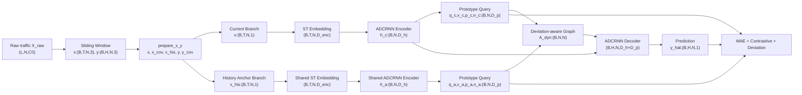
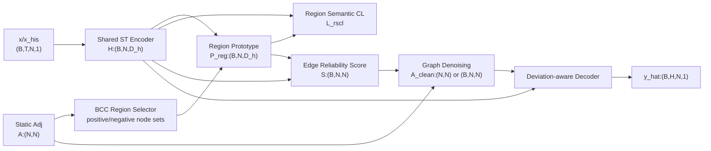
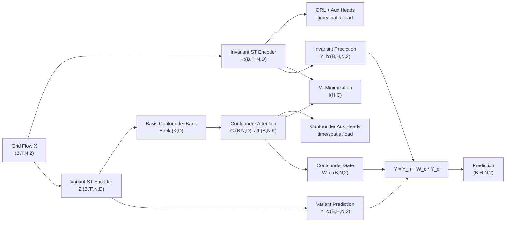
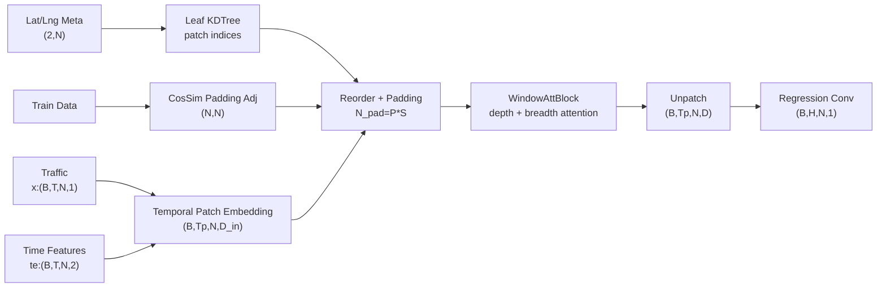
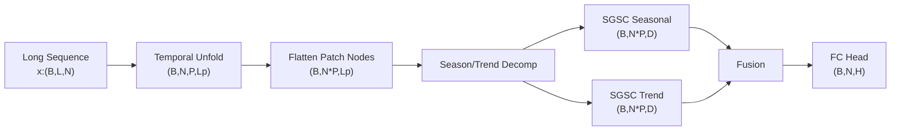

# TrafficRobustST 鲁棒交通预测修改方案

本文基于当前工作区中几类论文实现代码整理修改思路，目标不是简单拼接模块，而是根据数据集特征选择合适方法。当前 `TrafficRobustST` 已有 `data/METR-LA.h5` 与 `data/adj_mx.pkl`，其中 METR-LA 为 5 分钟粒度、207 个传感器、单主变量速度数据，时间范围为 2012-03-01 00:00:00 到 2012-06-27 23:55:00，原始矩阵形状为 `(34272, 207)`。

参考代码位置：

| 论文代码 | 关键实现 | 可借鉴点 |
|---|---|---|
| ST-SSDL | `ST-SSDL/model_STSSDL/STSSDL.py:168`, `ST-SSDL/model_STSSDL/train_STSSDL.py:57` | 历史锚点、可学习原型、偏差损失、动态图解码 |
| STEVE | `STEVE_CODE/STEVE/models/our_model.py:15`, `STEVE_CODE/STEVE/models/our_model.py:295` | 变/不变表示分离、混杂因子 bank、GRL、MI 解耦 |
| DarkFarseer | `DarkFarseer/networks/Kriging_model.py:11`, `DarkFarseer/utils/BCC_subgraph.py:143` | BCC 区域原型、稀疏/噪声图去噪、区域对比学习 |
| PatchSTG | `PatchSTG-main/PatchSTG-main/models/model.py:40`, `PatchSTG-main/PatchSTG-main/lib/utils.py:115` | 大规模节点空间分块、patch 内/patch 间注意力 |
| DST-SGNN | `DST-SGNN/model/MODEL.py:11`, `DST-SGNN/model/SGSC.py:9` | 长历史窗口、季节/趋势分解、RevIN、长预测步长 |

## 统一符号

| 符号 | 含义 |
|---|---|
| `B` | batch size |
| `T` | 输入历史长度，短期交通预测通常为 12 |
| `H` | 预测长度，短期交通预测通常为 12 |
| `N` | 节点数/区域数 |
| `C` | 原始特征通道数 |
| `D` | 隐表示维度 |
| `K` | 混杂因子 bank 或原型数量 |
| `M` | ST-SSDL 原型数量 |

## 数据集选择总表

| 数据集 | 数据特征 | 推荐方案 | 不推荐/谨慎使用 |
|---|---|---|---|
| METR-LA | `N=207`, 单速度变量，物理图明确，无外部特征 | 方案 A、方案 B；若做长预测可用方案 E | 不建议完整套 STEVE，因为缺少 inflow/outflow、真实 `c` load 标签 |
| PEMS-BAY | `N=325`, 单速度变量，物理图明确 | 方案 A、方案 B | 完整 STEVE 需要额外构造伪混杂标签，风险较高 |
| PEMS04 | `N=307`, 原始 `data` 形状 `(16992, 307, 3)`，通道较多 | 方案 A、方案 B；可尝试 STEVE-light | 完整 STEVE 的 `c` 仍需从数据分位数派生 |
| PEMS07 | `N=883`, 原始 `data` 形状 `(28224, 883, 1)`，节点多、单通道 | 方案 A、方案 B；若有经纬度可扩展方案 D | 不适合完整 STEVE |
| PEMS08 | `N=170`, 原始 `data` 形状 `(17856, 170, 3)`，通道较多 | 方案 A、方案 B；可尝试 STEVE-light | 节点少，不需要 PatchSTG |
| PEMSD7M | `N=228`, 原始 `data` 形状 `(12672, 228, 1)` | 方案 A、方案 B | 不适合完整 STEVE |
| NYCBike1 | `N=128`, `C=2` inflow/outflow, `time_label`, `c` 明确 | 方案 C | 不必优先用 PatchSTG |
| NYCBike2 / NYCTaxi | `N=200`, `C=2`, 时间和负载标签明确 | 方案 C | 不必优先用 PatchSTG |
| BJTaxi | `N=1024`, `C=2`, 大规模网格流量 | 方案 C；可叠加方案 D 的空间分块 | 纯 ST-SSDL 计算和空间建模会偏弱 |
| SD/GBA/GLA/CA | 大规模传感器，PatchSTG 配置中 SD `N=716`、CA `N=8600` | 方案 D | 不适合先上复杂混杂因子 |
| PEMS03/04/07/METR-LA CSV 长序列 | `seq_length=336`, `pre_length=96` 风格 | 方案 E | 不适合作为当前短期 12 步主线首选 |

ST-SSDL 已生成的 `his.npz` 数据维度可作为短期预测标准接口：

| 数据集 | `trainhis.npz/x.npy` | 说明 |
|---|---:|---|
| METRLA | `(23974, 12, 207, 3)` | value + TOD + history anchor |
| PEMS04 | `(10181, 12, 307, 3)` | 多通道原始数据转为 ST-SSDL 输入 |
| PEMS07 | `(16921, 12, 883, 3)` | 节点多，单主变量 |
| PEMS08 | `(10700, 12, 170, 3)` | 节点少但原始通道多 |
| PEMSD7M | `(7589, 12, 228, 3)` | 单主变量短期预测 |

## 方案 A：ST-SSDL 历史偏差原型主线

### 适用数据集

首选 METR-LA，随后扩展到 PEMS-BAY、PEMS04、PEMS08、PEMS07、PEMSD7M。

选择理由：这些数据集都有稳定周期性和物理邻接图，且大多数只有单个主要交通变量。ST-SSDL 不依赖外部天气/事件/负载标签，适合用历史锚点构造自监督偏差信号。

### 整体框架图



### 模块输入输出与作用

以 METR-LA 为例：`T=12`, `H=12`, `N=207`, `C0=1`, `D_h=128`, `D_p=64`。若使用 ST-SSDL 的 METRLA 配置，`D_enc = input_embedding_dim + tod_embed_dim + node_embedding_dim = 3 + 20 + 25 = 48`。

| 模块 | 输入维度 | 输出维度 | 作用 |
|---|---|---|---|
| Window Builder | `X_raw:(L,N,C0)` | `x:(B,T,N,3)`, `y:(B,H,N,3)` | 构造当前序列、时间协变量、历史锚点 |
| `prepare_x_y` | `x:(B,T,N,3)`, `y:(B,H,N,3)` | `x:(B,T,N,1)`, `x_cov:(B,T,N,1)`, `x_his:(B,T,N,1)`, `y:(B,H,N,1)`, `y_cov:(B,H,N,1)` | 按 ST-SSDL 约定拆分通道 |
| ST Embedding | `x:(B,T,N,1)`, `x_cov:(B,T,N,1)` | `x_emb:(B,T,N,D_enc)` | 融合输入值、TOD、节点嵌入 |
| ADCRNN Encoder | `x_emb:(B,T,N,D_enc)`, `A:(N,N)` | `h_seq:(B,T,N,D_h)`, `h:(B,N,D_h)` | 图循环编码当前/历史序列 |
| Prototype Query | `h:(B,N,D_h)` | `q,v,p,n:(B,N,D_p)`, `mask:(B,N,2)` | 将隐状态映射到可学习原型空间 |
| Deviation Distance | `q_c,q_a,p_c,p_a:(B,N,D_p)` | `latent_dis:(B,N)`, `prototype_dis:(B,N)` | 对齐输入偏差和原型偏差 |
| Dynamic Graph | `[h_c,v_c,h_a,v_a]:(B,N,2D_h+2D_p)` | `A_dyn:(B,N,N)` | 根据当前偏差生成样本级动态图 |
| ADCRNN Decoder | `go:(B,N,1)`, `A_dyn:(B,N,N)` | `y_hat:(B,H,N,1)` | 自回归多步预测 |
| Loss | `y_hat,y,q,p,n,dis` | scalar | `MAE + λ_c L_contrast + λ_d L_deviation` |

### 编码实现思路

1. 在 `TrafficRobustST/src` 中重建标准数据底座：`preprocessing.py` 负责读取 `METR-LA.h5`、训练切分内归一化、生成 `trainhis/valhis/testhis.npz`。
2. 从 ST-SSDL 迁移并拆分模块：`agcrn.py` 放 `AGCN/AGCRNCell/ADCRNN_Encoder/ADCRNN_Decoder`，`prototype.py` 放原型查询和偏差损失，`model.py` 放统一模型。
3. 保留 ST-SSDL 的双分支共享编码器设计，当前分支和历史锚点分支共享参数。
4. 训练时先只跑 METR-LA：`batch_size=64/128`，`horizon=12`，`λ_c=0.01`，`λ_d=1.0`。
5. 对 PEMS04/PEMS08 这种原始 `C0=3` 的数据，第一阶段仍以目标通道 `[...,0]` 作为预测主变量；第二阶段再把其他通道接入 `covariate_proj`。

### 预期价值

这是最稳的主线，适合当前 `TrafficRobustST` 已有数据。它能先建立鲁棒预测基线，并为后续 STEVE 混杂因子、DarkFarseer 图去噪提供统一接口。

## 方案 B：ST-SSDL + DarkFarseer 区域原型图去噪

### 适用数据集

首选 METR-LA、PEMS04、PEMS07、PEMS-BAY。

选择理由：这些数据集都有显式邻接矩阵，且交通图可能稀疏或含噪声。DarkFarseer 的 BCC 区域原型与 SDGS 图去噪适合处理“边可靠性不稳定”和“弱连接节点表示差”的问题。PEMS07 节点数为 883，更容易出现局部区域差异，适合作为验证图鲁棒性的扩展实验。

### 整体框架图



### 模块输入输出与作用

| 模块 | 输入维度 | 输出维度 | 作用 |
|---|---|---|---|
| ST-SSDL Encoder | `x_emb:(B,T,N,D_enc)`, `A:(N,N)` | `H:(B,N,D_h)` | 提供节点级时空表示 |
| BCC Selector | `A:(N,N)` | `positive_select`, `negative_select`, `notMap` | 用双连通分量构造区域正负样本 |
| Region Prototype | `H:(B,N,D_h)`, positive node sets | `P_reg:(B,N,D_h)` | 对每个节点聚合区域语义原型 |
| RSCL | `H:(B,N,D_h)`, `P_pos/P_neg` | scalar `L_rscl` | 拉近同区域节点，推远非同区域节点 |
| Edge Reliability | `H_i,H_j,P_i,P_j` | `S:(B,N,N)` | 估计边可靠性，类似 DarkFarseer 的 `cal_edge_weight` |
| SDGS Denoiser | `A:(N,N)`, `S:(B,N,N)` | `A_clean:(N,N)` 或 `A_clean:(B,N,N)` | 对低可信边降权或置为很小值 |
| Decoder | `H:(B,N,D_h)`, `A_clean` | `y_hat:(B,H,N,1)` | 使用去噪图预测 |

### 编码实现思路

1. 新增 `src/graph_regions.py`：迁移 `DarkFarseer/utils/BCC_subgraph.py:143` 的 `get_BBC`，输入统一为 numpy adjacency。
2. 新增 `src/graph_denoise.py`：实现 `RegionPrototypeBuilder` 和 `GraphDenoisingLayer`。
3. 不直接照搬 DarkFarseer 的 kriging 缺失节点设定，而是把“低度节点、高偏差节点、高预测误差节点”定义为 fragile nodes，作为 RSCL 的重点 anchor。
4. 训练损失改为：

   ```text
   L = L_mae + λ_c L_contrast + λ_d L_deviation + λ_r L_rscl + λ_s ||A_clean - A||_1
   ```

5. 第一版 `A_clean` 建议做 epoch 级静态更新：每个 epoch 根据训练集 batch 的平均边可靠性更新一次，避免每个 batch 生成 `B*N*N` 导致显存压力过大。
6. 对 METR-LA/PEMS-BAY 可使用 DarkFarseer 的默认阈值思路，邻接边阈值约为 `0.7`；PEMS04/PEMS03 可放宽到 `0.0`。

### 预期价值

方案 B 比方案 A 更强调图结构鲁棒性，适合写成“面向噪声交通图的偏差感知预测”。如果只在 METR-LA 上做，创新点不如 PEMS07/PEMS04 明显；建议至少加入 PEMS04 或 PEMS07。

## 方案 C：STEVE 风格混杂因子提取与因果解耦

### 适用数据集

首选 NYCBike1、NYCBike2、NYCTaxi、BJTaxi。PEMS04/PEMS08 可做 STEVE-light，但不建议作为完整 STEVE 主实验。

选择理由：STEVE 代码假设数据中有多种可监督的混杂信号：`X/Y` 为 inflow/outflow 双通道，`time_label` 提供时间类别，`c` 提供交通负载等级或强度标签。NYCBike/BJTaxi 这类网格区域流量天然具备这些特征。METR-LA 只有单个速度变量，硬套 STEVE 会把 `c` 变成伪标签，解释性变弱。

STEVE 配置中的数据特征：

| 数据集 | `N` | `input_length` | `C` | 特征 |
|---|---:|---:|---:|---|
| NYCBike1 | 128 | 19 | 2 | inflow/outflow, time label, load `c` |
| NYCBike2 | 200 | 35 | 2 | inflow/outflow, time label, load `c` |
| NYCTaxi | 200 | 35 | 2 | inflow/outflow, time label, load `c` |
| BJTaxi | 1024 | 35 | 2 | 大规模网格，inflow/outflow, load `c` |

### 整体框架图



### 模块输入输出与作用

STEVE 代码中 `Kt=3` 且有两个 STConvBlock，因此 `T' = input_length - 4*(Kt-1) = input_length - 8`。NYCBike1 的 `T'=11`，NYCBike2/NYCTaxi/BJTaxi 的 `T'=27`。

| 模块 | 输入维度 | 输出维度 | 作用 |
|---|---|---|---|
| Grid DataLoader | `X:(B,T,N,2)`, `Y:(B,H,N,2)`, `time_label:(B)`, `c:(B,N,2)` | batch tuple | 提供多通道流量和混杂监督 |
| Invariant Encoder | `X:(B,T,N,2)` | `H:(B,T',N,D)` | 学习稳定因果表征 |
| Variant Encoder | `X:(B,T,N,2)` | `Z:(B,T',N,D)` | 学习环境/混杂相关表征 |
| Basis Bank Generator | `Z:(B,T',N,D)` | `B_new:(B,K,D)` | 根据样本更新基础混杂因子 bank |
| Confounder Attention | `Q=mean_t(Z):(B,N,D)`, `Bank:(B,K,D)` | `C:(B,N,D)`, `att:(B,N,K)` | 提取节点级混杂表示 |
| Variant Aux Loss | `C:(B,N,D)`, `time_label`, `c` | scalar | 让混杂表示包含时间、空间、负载信息 |
| Invariant Aux Loss + GRL | `H:(B,T',N,D)`, `time_label`, `c` | scalar | 通过梯度反转去除 H 中的混杂信息 |
| MI Loss | `H:(B,N,D)`, `C:(B,N,D)` | scalar | 最小化稳定表示与混杂表示互信息 |
| Prediction Head | `H,Z,C` | `Y_hat:(B,H,N,2)` | 用稳定项和混杂调制项融合预测 |

### 编码实现思路

1. 新增 `src/confounder_steve.py`：迁移并轻量化 `confounder_ext`，保留 `Bank:(K,D)`、`mlp4bank`、`MLPAttention`。
2. 新增 `src/disentangle.py`：实现 `GradientReversalLayer`、`CLUB`、`InvariantAuxHead`、`VariantAuxHead`。
3. 新增 `src/datasets/grid_flow.py`：兼容 STEVE 的 `train.npz/val.npz/test.npz`，读取 `X/Y/time_label/c`。
4. 对 NYCBike/BJTaxi 保留完整三类辅助监督：时间分类、空间分类、负载回归。
5. 对 PEMS04/PEMS08 若做 STEVE-light，只使用：

   ```text
   C = ConfounderBank(Z)
   L = L_mae + λ_mi I(H,C)
   ```

   不强行加入 `c` 的伪标签，最多用目标通道分位数构造低/中/高 load 作为 ablation。

### 预期价值

方案 C 最适合“特征多、环境变化明显”的数据集。如果论文目标强调因果鲁棒性、未知混杂、分布偏移，建议选择 NYCBike2/NYCTaxi/BJTaxi，而不是当前 METR-LA。

## 方案 D：PatchSTG 空间分块大规模预测

### 适用数据集

首选 PatchSTG 原数据：SD、GBA、GLA、CA。若使用 BJTaxi，可根据规则网格坐标构造 `meta.csv` 后尝试结合空间分块。

选择理由：PatchSTG 的价值在大规模节点。METR-LA `N=207` 不足以体现空间 patch 的效率优势；CA `N=8600`、GLA `N=3334` 更能展示复杂度收益。

### 整体框架图



### 模块输入输出与作用

以 SD 配置为例：`T=12`, `H=12`, `N=716`, `tod=96`, `dow=7`, `tem_patchsize=12`, `tem_patchnum=1`, `input_dims=64`, `node_dims=64`, `tod_dims=32`, `dow_dims=32`，因此 `D = 192`。SD 的空间参数为 `spn=512`, `sps=2`, `factors=32`，padding 后 `N_pad=1024`，注意力内部 `P=16`, `S=64`。

| 模块 | 输入维度 | 输出维度 | 作用 |
|---|---|---|---|
| Dataset_Custom | raw `data:(L,N,1)` | `seq_x:(B,T,N,1)`, `seq_y:(B,H,N,1)`, `te:(B,T,N,2)` | 构造流量与 TOD/DOW 特征 |
| Spatial Manager | `meta:(2,N)`, train data | `ori_parts_idx`, `reo_parts_idx`, `reo_all_idx` | KDTree 分块与相似节点 padding |
| ST Embedding | `x:(B,T,N,1)`, `te:(B,T,N,2)` | `E:(B,Tp,N,D)` | 时间 patch + 时间/空间嵌入 |
| Reorder | `E:(B,Tp,N,D)`, indices | `E_pad:(B,Tp,N_pad,D)` | 按空间 patch 重排并补齐 |
| WindowAttBlock | `E_pad:(B,Tp,P*S,D)` | `E_pad:(B,Tp,P*S,D)` | patch 内深度注意力和 patch 间广度注意力 |
| Unpatch | `E_pad`, indices | `E:(B,Tp,N,D)` | 回到原节点顺序 |
| Regression Conv | `E:(B,Tp,N,D)` | `Y_hat:(B,H,N,1)` | 预测未来流量 |

### 编码实现思路

1. 新增 `src/patchstg_adapter.py`，封装 `PatchSTG` 的 `embedding/reorder/unpatch/regression`。
2. 新增 `src/spatial_patching.py`，迁移 `loadSpatialManagedIndices`、`kdTree`、`reorderData`。
3. 数据格式统一为：

   ```text
   traffic.npz: data:(L,N,1)
   meta.csv: Sensor,Lat,Lng
   adj.npy: optional, 用于 padding 相似节点
   ```

4. 对 SD/CA 直接走 PatchSTG 配置；对 BJTaxi 若无经纬度，可用网格行列号构造二维坐标。
5. 若想和方案 C 结合，可先在每个 spatial patch 内提取 STEVE confounder，再做 breadth attention，但这是第二阶段，不建议一开始就做。

### 预期价值

方案 D 的卖点是大规模效率，不是混杂解释。它适合把 TrafficRobustST 扩展成“可扩展交通预测框架”，尤其当实验数据节点数超过 700 时。

## 方案 E：DST-SGNN 长序列鲁棒预测

### 适用数据集

首选 PEMS03、PEMS04、PEMS07、METR-LA CSV、traffic、weather、electricity 等长序列多变量数据。

选择理由：DST-SGNN 代码默认 `seq_length=336`, `pre_length=96`，输入是长历史窗口，强调季节/趋势分解、RevIN 和频域/图谱结构建模。它适合长周期漂移，而不是当前 METR-LA 的 12 步短预测主任务。

### 整体框架图



### 模块输入输出与作用

以默认配置为例：`L=336`, `H=96`, `patch_len=48`, `stride=24`, `P=(336-48)/24+1=13`, `D=64`。

| 模块 | 输入维度 | 输出维度 | 作用 |
|---|---|---|---|
| Dataset_CSI | csv raw `(L_total,N)` | `x:(B,336,N)`, `y:(B,96,N)` | 长历史窗口切片 |
| Temporal Unfold | `x:(B,336,N)` | `patch:(B,N,13,48)` | 构造时间 patch |
| Flatten | `patch:(B,N,13,48)` | `z:(B,N*13,48)` | 将节点和 patch 合并为图谱建模对象 |
| Series Decomp | `z:(B,N*13,48)` | `season, trend:(B,N*13,48)` | 分离周期项和趋势项 |
| RevIN | `token:(B,N*13,D)` | normalized token | 缓解非平稳分布 |
| SGSC | `token:(B,N*13,D)` | `feat:(B,N,D*12)` | 动态图谱变换 |
| FC Head | `feat:(B,N,D*12)` | `Y_hat:(B,N,96)` | 长步长预测 |

### 编码实现思路

1. 新增 `src/long_horizon_dataset.py`，将 METR-LA h5 或 PEMS npz 导出为 DST-SGNN 风格 csv/array。
2. 新增 `src/dstsgnn_backbone.py`，迁移 `RevIN`、`series_decomp`、`SGSC`，删除硬编码 `cuda:0`。
3. 输出统一转为 `(B,H,N,1)`，方便复用 TrafficRobustST 的 metric。
4. 与方案 A 对比时必须区分任务：方案 A 是 12->12，方案 E 是 336->96；不能直接比较 MAE 数值而不说明设置。

### 预期价值

方案 E 适合扩展“长期交通预测”和“非平稳长周期鲁棒性”。如果当前论文主题是短期鲁棒预测，它应作为附加实验或后续方向。

## 推荐落地顺序

| 阶段 | 做什么 | 数据集 | 目的 |
|---|---|---|---|
| 1 | 方案 A：实现 ST-SSDL 主线 | METR-LA | 建立当前仓库可训练、可复现实验底座 |
| 2 | 方案 B：加入 BCC 区域原型与图去噪 | METR-LA + PEMS04/PEMS07 | 形成图鲁棒创新点 |
| 3 | 方案 C：另起 grid-flow 分支接 STEVE | NYCBike2/NYCTaxi 或 BJTaxi | 验证多特征混杂因子提取 |
| 4 | 方案 D：大规模空间 patch | SD/CA 或 BJTaxi | 验证大规模扩展能力 |
| 5 | 方案 E：长序列预测 | PEMS04/METR-LA CSV | 补充长期预测鲁棒性 |

## 我建议优先写成的论文式改进方向

最推荐的主线是：

```text
ST-SSDL 历史偏差原型
    + DarkFarseer 区域语义原型
    + 可靠边图去噪
    = Deviation-aware Region-Prototype Graph Denoising for Robust Traffic Forecasting
```

对应实验数据：

| 主实验 | 数据集 | 理由 |
|---|---|---|
| 必做 | METR-LA | 当前仓库已有，单变量速度，适合作为基础复现 |
| 必做 | PEMS04 | 有 3 个原始通道，图结构和数据规模适中 |
| 建议 | PEMS07 | `N=883`，更能体现图去噪与节点规模鲁棒性 |
| 可选 | PEMS08 | 节点少、通道多，适合做多通道 ablation |

不建议把 STEVE 完整模块作为第一主线接到 METR-LA 上，因为 METR-LA 缺少 STEVE 依赖的 inflow/outflow、`time_label`、`c` 负载标签。STEVE 更适合作为第二条独立分支，在 NYCBike/NYCTaxi/BJTaxi 上验证“多特征混杂因子提取”。

## 代码目录建议

```text
TrafficRobustST/
  src/
    preprocessing.py          # split-aware window and history anchor
    datasets/
      sensor_npz.py           # METR-LA/PEMS short-horizon loader
      grid_flow.py            # STEVE-style Bike/Taxi loader
      long_horizon.py         # DST-SGNN-style loader
    models/
      agcrn.py                # AGCN/AGCRN encoder decoder
      stssdl_backbone.py      # scheme A
      prototype.py            # learnable prototypes and deviation loss
      graph_regions.py        # BCC selectors
      graph_denoise.py        # scheme B SDGS-like denoising
      confounder_steve.py     # scheme C
      patchstg_adapter.py     # scheme D
      dstsgnn_backbone.py     # scheme E
    train.py                  # common trainer
    metrics.py                # MAE/RMSE/MAPE horizon-wise metrics
  configs/
    metrla_stssdl.yaml
    pems04_region_denoise.yaml
    nyctaxi_steve.yaml
    sd_patchstg.yaml
  docs/
    鲁棒交通预测修改方案.md
```

## 最小可行实现

第一版不需要一次实现所有方案，建议先做以下闭环：

1. `METR-LA.h5 -> trainhis/valhis/testhis.npz`，确认输出 `x:(B,12,207,3)`。
2. 实现方案 A，跑通一个 batch forward，输出 `y_hat:(B,12,207,1)`。
3. 加入 horizon-wise metric，输出 15/30/60 分钟 MAE/RMSE/MAPE。
4. 再加入方案 B 的 `BCCSelector` 和 `GraphDenoisingLayer`，先只用 `A_clean` 替换 decoder 图。
5. 完成 METR-LA 与 PEMS04 对比，再决定是否开启方案 C 的 STEVE 分支。
